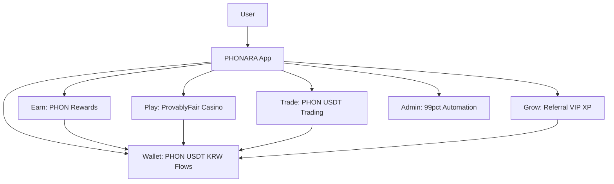
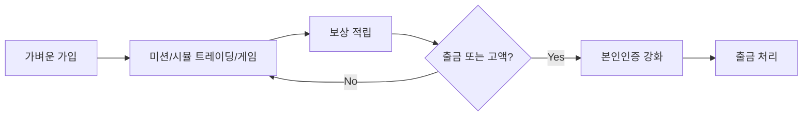
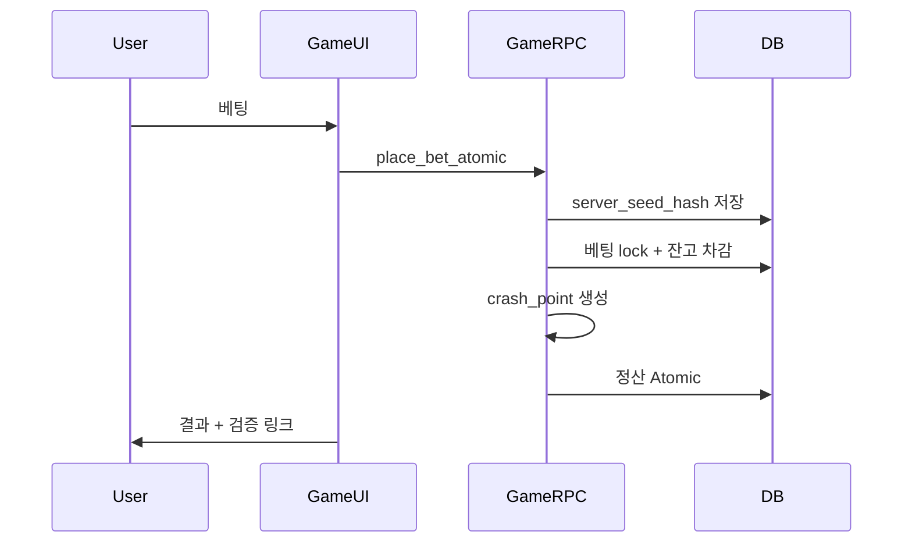
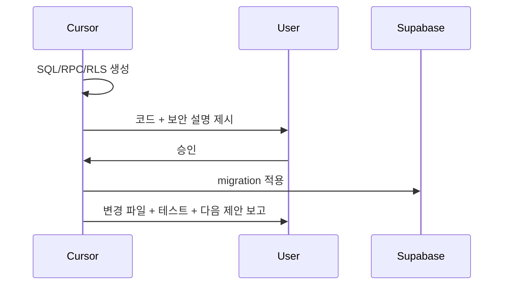

# PHONARA v2 — 최종 확정 지존급 마스터 플랜

> **단일 진실 공급원**: [`PHONARA_MASTER_PROMPT_V2_FINAL(마스터)파이널 (1).md`](c:\Users\PC\Desktop\PHONARA_MASTER_PROMPT_V2_FINAL(마스터)파이널 (1).md)  
> **레포**: [phonaralv/phonara-gb](https://github.com/phonaralv/phonara-gb.git)  
> **Supabase**: `yocjhjsdwoijfdrehzoq`  
> **현재**: npm+Vite 스캐폴드만 존재, DB 비어 있음
> **최종 확정 기준일**: 2026-06-08

---

## 최종 확정 방향 (이 섹션이 모든 이전 계획보다 우선)

### 확정된 제외/보류 사항

- **카카오 로그인**: 지금 당장 사용하지 않음. 추후 가능하면 연동.
- **PG사 연동**: 지금 당장 사용하지 않음. 추후 글로벌/상용 확장 시 가능하면 사용.
- **법무**: 변호사 상담 완료 상태로 진행. 다만 모든 금전/입출금 로직은 감사 가능하게 설계.

### 확정된 입출금 방식

- **코인 입출금**: USDT, PHON 등 직접 지원.
- **한국 원화 계좌이체 입출금**: PG 없이 직접 처리.
- **원화 입금 흐름**: 원화 입금 → PHON으로 환전. 입금창, 상태 페이지, 알림에서 사용자가 반드시 인지하도록 설계.
- **출금 흐름**: 코인(USDT/PHON) + 원화 계좌이체 모두 지원.

### 확정된 운영 형태

- `apps/web`: 일반 유저 앱.
- `apps/admin`: 관리자 전용 별도 앱.
- 운영 목표: **1인 운영 + 99% 자동화 Admin**.
- Admin은 정상 건을 자동 처리하고, 이상 거래·고액·불일치·보안 플래그만 수동 승인.

### 확정된 통화/경제 구조

- **PHON**: 플랫폼 중심 토큰.
- **USDT**: 게임/트레이딩용 안정 통화.
- **무료 보상**: 미션, 출석, 룰렛, 추천 등은 **PHON으로만 지급**.
- **게임 베팅**: PHON + USDT 가능.
- **트레이딩**: PHON + USDT 가능.
- **원화 계좌이체**: PHON 환전/정산 진입 수단.

### PHON 기준가에 대한 Cursor 추천

**추천: 내부 원장 기준은 USDT, 한국 UI 기준은 KRW 병행 표시.**

이유:

- 글로벌 확장, 코인 입출금, USDT 게임/트레이딩을 고려하면 **USDT 기준가가 원장·정산·리스크 관리에 더 안정적**입니다.
- 한국 사용자는 원화 체감이 중요하므로 모든 화면에 `1 PHON ≈ n원`을 항상 표시해야 합니다.
- 따라서 DB/정산은 `PHON_USDT_RATE`를 기준으로 하고, UI/입금창/알림은 `PHON_KRW_RATE = PHON_USDT_RATE * USDT_KRW_RATE`로 표시합니다.

운영 예시:

```text
원장 기준: 1 PHON = 0.01 USDT
한국 표시: 1 PHON ≈ 13원 (USDT/KRW 1,300원 기준)
입금 안내: 13,000원 입금 시 약 1,000 PHON 지급
```

필수 원칙:

- 환율 스냅샷을 모든 환전/입출금/게임/트레이딩 거래에 저장.
- 사용자가 입금 전에 예상 PHON 수량, 적용 환율, 수수료, 처리 상태를 명확히 확인.
- PHON 기준가는 관리자 설정으로 변경 가능하되, 변경 이력은 `platform_rate_history`에 감사 로그로 남김.

---

## 최종 Phase 로드맵 (간소화 확정판)

| Phase | 주요 내용 | 핵심 산출물 | 기간 감각 |
|-------|-----------|-------------|-----------|
| 0 | 기반 정리 + 거버넌스 | `.cursorrules`, `docs`, Bun+TanStack Start, `apps/web`, `apps/admin`, Playwright | 1~2일 |
| 1 | Auth + Wallet + PHON 잔고 시스템 | Atomic RPC, 프로필+지갑 생성, PHON/USDT/KRW 원장, Progressive Verification | 4~6일 |
| 2 | 고품질 리텐션 | 출석, 룰렛, 추천, 스트릭, PHON 보상 홈 대시보드 | 5~7일 |
| 3 | Trading (PHON + USDT) | Simulated Long/Short, 차트, PnL, PHON/USDT 정산 | 7~10일 |
| 4 | Casino (Crash, Limbo 중심) | Provably Fair, 서버 권위 RNG, PHON/USDT 베팅 | 7~10일 |
| 5 | 출금 + 자동화 Admin | 입출금 큐, 환전 자동화, 예외 수동 승인, 리스크 플래그 | 6~8일 |
| 6 | 폴리시 + 운영 고도화 | PWA, 성능, 리더보드, 보안, 모니터링, 감사 로그 | 지속 |

---

## 최상위 개발자 작업 순서 원칙

왕초보가 보기에는 화면부터 만드는 것이 쉬워 보이지만, PHONARA처럼 돈·게임·트레이딩·출금이 있는 플랫폼은 **UI보다 엔진, 원장, 보안, 테스트를 먼저 세우는 순서**가 맞습니다. 화면은 나중에 바꿀 수 있지만, 원장/정산/보안 구조가 틀리면 플랫폼 전체가 무너집니다.

### 작업 순서 핵심 철학

```text
문서/규칙
→ 타입/도메인 모델
→ Money/Decimal/원장 엔진
→ DB schema/RLS/RPC 초안
→ 테스트
→ 코어 엔진
→ 최소 UI
→ E2E
→ Admin 자동화
→ PWA/성능/운영
```

### 왜 이 순서인가

- 지갑/원장은 모든 기능의 심장.
- 게임/트레이딩/스테이킹은 모두 원장 위에서 움직임.
- Supabase RLS/RPC가 늦게 들어가면 나중에 보안 리팩토링이 크게 터짐.
- UI를 먼저 만들면 예뻐 보이지만 실제 돈 흐름이 틀릴 수 있음.
- E2E는 기능 완성 후가 아니라, 위험한 흐름이 생기는 순간부터 같이 들어가야 함.

---

## 실제 작업 순서 (상위 0.00000000000001% 방식으로 정렬)

### Step 0 — 헌법부터 고정

- [ ] `.cursorrules`
- [ ] `.cursor/rules/*`
- [ ] `docs/FINAL_DIRECTION.md`
- [ ] `docs/QUALITY_GATES.md`
- [ ] `docs/REFERENCE_REPOS.md`
- [ ] `docs/THREAT_MODEL.md`
- [ ] `docs/WALLET_LEDGER.md`
- [ ] `docs/TRADING_ENGINE.md`
- [ ] `docs/GAME_ENGINE.md`

목표: Cursor가 앞으로 절대 어긋나지 않게 기준을 먼저 고정.

### Step 1 — 프로젝트 골격과 품질 게이트

- [ ] Bun + TanStack Start
- [ ] `apps/web`
- [ ] `apps/admin`
- [ ] `packages/shared-types`
- [ ] `packages/money`
- [ ] `packages/wallet-ledger`
- [ ] `packages/trading-engine`
- [ ] `packages/game-engine`
- [ ] ESLint/Prettier/TS strict
- [ ] Vitest/Playwright
- [ ] cleanup scripts

목표: 아무 기능을 만들기 전에 품질과 테스트가 돌아가는 구조 확보.

### Step 2 — 타입과 Money 엔진

- [ ] Currency 타입: `PHON`, `USDT`, `KRW`
- [ ] Decimal.js wrapper
- [ ] Money amount 표준 타입
- [ ] 환율 스냅샷 타입
- [ ] 수수료 계산 유틸
- [ ] rounding policy
- [ ] 단위 테스트

목표: 금액 계산 실수를 시작부터 차단.

### Step 3 — Wallet Ledger 엔진

- [ ] append-only ledger 모델
- [ ] available/locked balance 모델
- [ ] credit/debit/lock/unlock/reversal 설계
- [ ] idempotency key 설계
- [ ] ledger consistency check 설계
- [ ] 단위 테스트

목표: 모든 기능의 정산 기반 완성.

### Step 4 — Supabase schema/RLS/RPC 초안

주의: 이 단계에서는 SQL/RPC를 **생성해서 사용자에게 보여주고 승인받기 전까지 적용하지 않음**.

- [ ] profiles
- [ ] wallets
- [ ] wallet_ledger
- [ ] exchange_rate_snapshots
- [ ] krw_deposit_requests
- [ ] withdrawal_requests
- [ ] audit_logs
- [ ] RLS policies
- [ ] Atomic RPC 초안
- [ ] RLS negative test 초안

목표: DB 보안을 초기에 확정.

### Step 5 — Auth + 최소 Wallet UI

- [ ] 이메일/매직링크 로그인
- [ ] 프로필 생성
- [ ] 지갑 조회
- [ ] 원장 보기
- [ ] 원화 입금 → PHON 예상 환전 UI
- [ ] E2E: 가입 → 지갑 → 보너스 → 원장

목표: 유저가 안전하게 들어오고 잔고를 믿을 수 있게 함.

### Step 6 — Trading 엔진 먼저, UI는 나중

- [ ] Spot 엔진: PHON/USDT 매수/매도
- [ ] Futures 엔진: Long/Short, PnL, liquidation
- [ ] Staking 엔진: stake/unstake/claim
- [ ] Decimal.js 단위 테스트
- [ ] 엔진 테스트 통과 후 UI 작성
- [ ] E2E: spot/futures/staking

목표: Binance/Bybit식 핵심은 UI가 아니라 정산 엔진이므로 엔진을 먼저 완성.

### Step 7 — Game 엔진

- [ ] fairness 공통 모듈
- [ ] Crash
- [ ] Limbo
- [ ] Dice
- [ ] Mines
- [ ] HiLo
- [ ] Plinko
- [ ] RTP/확률 테스트
- [ ] 검증 UI
- [ ] E2E: 베팅 → 정산 → 검증

목표: Stake식 핵심은 예쁜 게임 화면보다 조작 불가능한 검증 구조.

### Step 8 — 리텐션/이벤트/레퍼럴

- [ ] 출석
- [ ] 룰렛
- [ ] 스트릭
- [ ] 추천
- [ ] 등급
- [ ] FOMO 이벤트
- [ ] Founder badge
- [ ] E2E: 보상 지급/추천/이벤트

목표: 0원 출시에서 자연 유입과 재방문을 만드는 성장 루프.

### Step 9 — Admin 자동화

- [ ] 입금 대조
- [ ] PHON 환전 자동/반자동
- [ ] 출금 큐
- [ ] risk flags
- [ ] 자동 승인 룰
- [ ] 예외 수동 승인
- [ ] kill switch
- [ ] audit dashboard
- [ ] E2E: Admin 승인/거절

목표: 1인 운영 가능하게 함.

### Step 10 — PWA/성능/운영

- [ ] manifest
- [ ] service worker
- [ ] push notification
- [ ] install prompt
- [ ] offline fallback
- [ ] Lighthouse
- [ ] Sentry/PostHog
- [ ] backup/DR
- [ ] cleanup automation

목표: 스토어 없이 앱처럼 쓰고 운영 가능한 상태.

---

## 작업 방식 규칙

- 한 번에 큰 기능을 만들지 않음.
- 먼저 타입과 엔진을 만들고 테스트.
- 그 다음 DB/RPC/RLS.
- 그 다음 최소 UI.
- 마지막에 E2E와 청소.
- 위험도가 높은 작업은 반드시 사용자에게 중간 확인.
- 사용자는 왕초보이므로 Cursor가 다음 작업을 제안하고 설명.

### 각 작업의 완료 정의

```text
구현 완료 =
  코드 작성
+ 타입 통과
+ 단위 테스트
+ 필요한 E2E
+ 보안/RLS 확인
+ 테스트 잔재 청소
+ 변경 보고
```

---

## 최종 To-do 체계 (오류와 오차를 줄이는 실행 단위)

### Phase 0 — 기반 정리 + 거버넌스

- [ ] `docs/FINAL_DIRECTION.md`에 본 최종 확정 방향 기록
- [ ] `docs/MASTER_PROMPT.md`에 마스터 프롬프트 `(1).md` 동기화
- [ ] `.cursorrules` 작성: 승인, Supabase, Atomic RPC, Decimal.js, Admin 자동화 원칙
- [ ] `.cursor/rules/` 작성: core, Supabase safety, money atomic, testing, admin automation, FX ledger
- [ ] `.cursor/rules/10-quality-gates.mdc` 작성: lint, format, strict TS, tests, security, performance
- [ ] `docs/QUALITY_GATES.md` 작성: 코드/테스트/보안/성능/아키텍처/Git 완료 기준
- [ ] `docs/REFERENCE_REPOS.md` 작성: 사용자가 보낸 모든 레퍼런스 레포를 카테고리별 정리
- [ ] `docs/ADR/0001-quality-gates.md` 작성: 왜 이 품질 기준을 채택했는지 기록
- [ ] ESLint 엄격 설정: no-explicit-any, no-console, consistent-return, unused imports
- [ ] Prettier 설정
- [ ] TypeScript strict, noImplicitAny, strictNullChecks 강제
- [ ] Husky + lint-staged pre-commit hook 설계
- [ ] dead code 탐지 도구 후보 등록: knip 또는 ts-prune
- [ ] 의존성 점검 도구 후보 등록: bun audit, depcheck, CodeQL/Snyk 추후
- [ ] Bun + TanStack Start 구조로 전환
- [ ] `apps/web`와 `apps/admin` 앱 분리
- [ ] `packages/shared-types`, `packages/ui`, `packages/game-engine`, `packages/trading-engine`, `packages/money` 골격 생성
- [ ] `supabase/migrations`, `supabase/templates`, `supabase/functions` 골격 생성
- [ ] Playwright + Vitest 설정
- [ ] `bun run dev`, `bun run build`, `bun run test` 기준선 정의

### Phase 1 — Auth + Wallet + PHON/USDT/KRW 원장

- [ ] 카카오 로그인 제외, 이메일/매직링크 중심 Auth 플로우 설계
- [ ] 추후 카카오 로그인 확장 슬롯만 문서화
- [ ] `profiles` 스키마 초안 작성
- [ ] `wallets` 스키마 초안 작성: `phon_available`, `phon_locked`, `usdt_available`, `usdt_locked`
- [ ] `wallet_ledger` 스키마 초안 작성: 모든 잔고 변화 불변 기록
- [ ] `exchange_rate_snapshots` 스키마 초안 작성
- [ ] `krw_deposit_requests` 스키마 초안 작성
- [ ] `coin_deposit_addresses` / `coin_deposits` 스키마 초안 작성
- [ ] `create_profile_wallet_atomic` RPC 초안 작성
- [ ] `credit_wallet_atomic` RPC 초안 작성
- [ ] `debit_wallet_atomic` RPC 초안 작성
- [ ] `convert_krw_to_phon_atomic` RPC 초안 작성
- [ ] RLS 정책 초안 작성: 유저는 자기 지갑/원장만 조회, 직접 수정 금지
- [ ] E2E: 가입 → 지갑 생성 → PHON 웰컴 보상 → 원장 확인
- [ ] E2E: 원화 입금 신청 → 예상 PHON/환율/수수료 표시

### Phase 2 — PHON 보상 리텐션

- [ ] `daily_claims`, `roulette_spins`, `referrals`, `streaks`, `missions` 스키마 초안
- [ ] 모든 보상 지급 통화는 PHON으로 고정
- [ ] `claim_daily_reward_atomic` RPC 초안
- [ ] `spin_daily_roulette_atomic` RPC 초안
- [ ] `grant_referral_reward_atomic` RPC 초안
- [ ] `update_streak_atomic` RPC 초안
- [ ] 홈 대시보드: 오늘 받을 수 있는 PHON, 누적 PHON, 추천 수익
- [ ] 저품질 미션/과장 수익 문구 금지 정책 문서화
- [ ] E2E: 출석 → PHON 지급 → 원장 확인
- [ ] E2E: 룰렛 → 서버 결과 → PHON 지급
- [ ] E2E: 추천 가입 → 추천인 PHON 지급

### Phase 3 — Trading PHON + USDT

- [ ] `trading_markets` 스키마: PHON, USDT 마켓 구분
- [ ] `price_ticks` 스키마: 가격/오라클 스냅샷
- [ ] `trading_positions` 스키마: isolated margin, leverage, liquidation
- [ ] `trading_orders` 또는 `trading_actions` 스키마
- [ ] `open_position_atomic` RPC 초안
- [ ] `close_position_atomic` RPC 초안
- [ ] `liquidate_position_atomic` RPC 초안
- [ ] PnL 계산은 Decimal.js만 사용
- [ ] 차트 UI와 PnL calculator 설계
- [ ] E2E: PHON Long → 청산 → PHON 원장 반영
- [ ] E2E: USDT Short → 청산 → USDT 원장 반영
- [ ] 단위 테스트: liquidation, rounding, fee, PnL

### Phase 4 — Casino PHON + USDT

- [ ] Crash 게임 엔진 설계: HMAC-SHA256, server seed hash, client seed, nonce
- [ ] Limbo 게임 엔진 설계
- [ ] `game_rounds`, `game_bets`, `game_seed_reveals` 스키마 초안
- [ ] `place_game_bet_atomic` RPC 초안
- [ ] `settle_game_bet_atomic` RPC 초안
- [ ] PHON/USDT 베팅 통화 선택 UI
- [ ] Provably Fair 검증 UI
- [ ] 단위 테스트: deterministic result
- [ ] 단위 테스트: RTP 99% 통계 범위
- [ ] E2E: Crash 베팅 → 정산 → 원장 확인
- [ ] E2E: Limbo 베팅 → 정산 → 원장 확인

### Phase 5 — 출금 + 99% 자동화 Admin

- [ ] `apps/admin` 인증/접근 제어 설계
- [ ] `admin_review_queue` 스키마 초안
- [ ] `withdrawal_requests` 스키마: KRW, USDT, PHON
- [ ] `deposit_reconciliation_jobs` 스키마: 원화 입금 자동 대조
- [ ] `risk_flags` 스키마: 이상거래, 다계정, 금액 불일치, 고액
- [ ] `approve_deposit_and_convert_atomic` RPC 초안
- [ ] `request_withdrawal_atomic` RPC 초안
- [ ] `approve_withdrawal_atomic` RPC 초안
- [ ] `reject_withdrawal_atomic` RPC 초안
- [ ] `freeze_user_atomic` RPC 초안
- [ ] 자동 승인 룰: 정상 소액, 환율 일치, 리스크 없음
- [ ] 수동 승인 룰: 고액, 신규 계좌, 불일치, 리스크 플래그
- [ ] Admin 알림: 긴급/경고/정보
- [ ] E2E: 원화 입금 자동 환전
- [ ] E2E: 출금 신청 → 예외 큐 → 관리자 승인

### Phase 6 — 폴리시 + 운영 고도화

- [ ] PWA 모바일 앱급 UX
- [ ] 60fps 애니메이션 기준
- [ ] 리더보드: 보상, 트레이딩, 게임
- [ ] VIP/레벨 정책
- [ ] Sentry 에러 추적
- [ ] PostHog 제품 분석
- [ ] 감사 로그 대시보드
- [ ] 백업/복구 플레이북
- [ ] Rate limit, CSRF, CSP
- [ ] RLS negative tests
- [ ] 부하 테스트: 핵심 RPC와 실시간 채널
- [ ] 보안 테스트: SQL injection, XSS, 권한 우회

---

## 품질 게이트 (Stake/Rollbit/Binance/Bybit급 체감 품질을 위한 기준)

- **금전 정확도**: 모든 잔고 변경은 Atomic RPC + `wallet_ledger` + 환율 스냅샷.
- **게임 공정성**: 클라이언트 RNG 금지, 서버 seed hash 선공개, 결과 검증 UI.
- **트레이딩 정합성**: Decimal.js, isolated margin, PnL 단위 테스트, liquidation edge case.
- **운영 자동화**: 정상 건 자동 처리, 예외만 수동 승인, 모든 Admin 작업 감사 로그.
- **사용자 인지**: 원화 입금 → PHON 환전은 입금창/상태/알림에서 반복 고지.
- **보안**: 유저 데이터 RLS, 관리자 권한 분리, 고위험 액션 2FA 준비.
- **검증**: Phase별 E2E 통과 전 다음 Phase로 넘어가지 않음.

---

## 대형 사이트급 핵심 UX: 이벤트, 버튼, 기능 우선순위

### 제품 우선순위 재확정

게임은 사용자가 보낸 최고급 레퍼런스 레포들을 기준으로 **6종 전체를 최종 범위에 포함**합니다. 단, 출시 순서는 위험을 줄이기 위해 Crash/Limbo 엔진 검증 후 Dice, Mines, HiLo, Plinko로 확장합니다. 핵심 제품 무게중심은 **자체 현물, 자체 선물, 자체 스테이킹**에 두고, 게임은 Provably Fair 신뢰 장치와 리텐션 장치로 고품질 구현합니다. 외부 대형 거래소에 주문을 연동하지 않고, PHONARA 내부 원장과 자체 엔진으로 독립 운영합니다.

```text
1순위: Wallet + PHON/USDT 원장
2순위: 현물 거래
3순위: 선물/Long Short
4순위: 스테이킹
5순위: 6종 Provably Fair 게임 엔진
6순위: 추가 게임/라이브 게임 확장
```

### 대형 플랫폼급 주요 버튼

| 영역 | 버튼 | 목적 |
|------|------|------|
| 홈 | 오늘 PHON 받기 | 매일 진입 CTA |
| 홈 | 3분 부업 시작 | 20대~70대 공통 진입 |
| 지갑 | 입금하기 | KRW/USDT/PHON 입금 |
| 지갑 | 출금하기 | KRW/USDT/PHON 출금 |
| 지갑 | PHON 환전하기 | KRW → PHON, USDT → PHON |
| 지갑 | 원장 보기 | 신뢰 확보 |
| 현물 | 매수 | PHON/USDT 자체 거래 |
| 현물 | 매도 | PHON/USDT 자체 거래 |
| 선물 | Long | 상승 포지션 |
| 선물 | Short | 하락 포지션 |
| 선물 | 포지션 닫기 | 정산 |
| 선물 | 손절/익절 설정 | 리스크 관리 |
| 스테이킹 | 스테이킹 시작 | PHON 잠금 |
| 스테이킹 | 보상 받기 | PHON 보상 claim |
| 리텐션 | 룰렛 돌리기 | 일일 보상 |
| 리텐션 | 친구 초대 | 0원 성장 |
| Admin | 자동 승인 | 정상 건 처리 |
| Admin | 예외 검토 | 리스크 건 수동 처리 |
| Admin | 유저 제한 | 이상 거래 대응 |

### 버튼 설계 원칙

- 초보자는 "매수/매도/Long/Short"보다 먼저 **위험 설명과 예상 결과**를 봐야 함.
- 모든 금전 버튼은 클릭 전 확인 모달:
  - 사용 통화
  - 수량
  - 적용 환율
  - 수수료
  - 예상 결과
  - 원장 기록 여부
- 고위험 버튼은 한 번 더 확인:
  - 고배율 선물
  - 출금
  - 스테이킹 잠금
  - 관리자 유저 제한

---

## 자체 Trading 시스템: 외부 거래소 연동 없음

### 기본 원칙

- Binance/Bybit 같은 외부 거래소에 주문을 보내지 않음.
- PHONARA 내부 지갑, 내부 원장, 내부 포지션, 내부 정산으로 운영.
- 가격 참조는 오라클/시장 기준가를 사용할 수 있지만, 체결과 정산은 PHONARA 내부 시스템이 수행.
- 모든 거래 결과는 `wallet_ledger`, `trade_ledger`, `position_ledger`에 남김.

### 현물 거래 (Spot)

초기 현물은 복잡한 다중 오더북보다 **PHON/USDT 자체 마켓**부터 시작합니다.

#### Spot MVP

- 마켓: `PHON/USDT`
- 주문 방식:
  - 시장가 매수/매도
  - 지정가 매수/매도는 Phase 2 확장
- 가격:
  - Admin 기준가 + 내부 유동성 풀
  - 모든 체결에 가격 스냅샷 저장
- 정산:
  - 매수: USDT 차감 → PHON 증가
  - 매도: PHON 차감 → USDT 증가

#### Spot To-do

- [ ] `spot_markets` 스키마
- [ ] `spot_orders` 스키마
- [ ] `spot_trades` 스키마
- [ ] `liquidity_pools` 스키마
- [ ] `place_spot_market_buy_atomic` RPC
- [ ] `place_spot_market_sell_atomic` RPC
- [ ] `place_spot_limit_order_atomic` RPC (확장)
- [ ] `cancel_spot_order_atomic` RPC (확장)
- [ ] PHON/USDT 차트
- [ ] 호가/최근 체결 UI
- [ ] E2E: USDT로 PHON 매수 → 원장 검증
- [ ] E2E: PHON 매도 → USDT 증가 검증

### 선물 거래 (Futures / Perpetual)

초기 선물은 Rollbit처럼 사용자가 이해하기 쉬운 **simulated perpetual**로 시작합니다. 외부 거래소 주문 연동 없이 내부 포지션 정산입니다.

#### Futures MVP

- 마켓:
  - `PHONUSDT-PERP`
  - `BTCUSDT-SIM`
  - `ETHUSDT-SIM`
- 통화:
  - PHON 증거금
  - USDT 증거금
- 기능:
  - Long/Short
  - isolated margin
  - leverage cap
  - liquidation price
  - stop loss
  - take profit
  - funding fee는 초기 단순화 또는 비활성

#### Futures To-do

- [ ] `futures_markets` 스키마
- [ ] `futures_positions` 스키마
- [ ] `futures_orders` 스키마
- [ ] `funding_snapshots` 스키마
- [ ] `oracle_price_ticks` 스키마
- [ ] `open_futures_position_atomic` RPC
- [ ] `close_futures_position_atomic` RPC
- [ ] `update_stop_loss_take_profit_atomic` RPC
- [ ] `liquidate_position_atomic` RPC
- [ ] `settle_funding_atomic` RPC (확장)
- [ ] Long/Short 패널
- [ ] 포지션 카드
- [ ] 청산가 계산기
- [ ] PnL 실시간 표시
- [ ] E2E: PHON Long → 수익 정산
- [ ] E2E: USDT Short → 손실 정산
- [ ] E2E: 청산 조건 → locked balance 정산
- [ ] Unit: Decimal.js PnL/수수료/청산가

### 스테이킹

스테이킹은 "부수입" 메시지와 잘 맞지만, 실제 고정 수익처럼 과장하면 위험합니다. 초기에는 **플랫폼 보상 풀 기반 PHON 스테이킹**으로 설계합니다.

#### Staking MVP

- 통화: PHON
- 기간:
  - Flexible
  - 7일
  - 30일
  - 90일
- 보상:
  - 고정 보장 문구 금지
  - 예상 보상률은 변동 가능 표시
  - 보상 풀 기준 분배
- 해지:
  - Flexible은 즉시 해지
  - Lock 상품은 만기 후 해지
  - 조기 해지 수수료는 추후 검토

#### Staking To-do

- [ ] `staking_pools` 스키마
- [ ] `staking_positions` 스키마
- [ ] `staking_rewards` 스키마
- [ ] `stake_phon_atomic` RPC
- [ ] `unstake_phon_atomic` RPC
- [ ] `claim_staking_reward_atomic` RPC
- [ ] 예상 보상 계산 UI
- [ ] 잠금 기간 확인 모달
- [ ] E2E: PHON 스테이킹 → locked 처리
- [ ] E2E: 보상 claim → PHON 원장 반영

---

## 대형 플랫폼급 이벤트/프로모션 확장

### Trading 이벤트

| 이벤트 | 설명 | 보상 |
|--------|------|------|
| 첫 현물 거래 보너스 | PHON/USDT 첫 spot 거래 완료 | PHON |
| 첫 Long/Short 체험 | 손실 제한형 첫 선물 체험 | PHON 또는 수수료 쿠폰 |
| 주간 PnL 챌린지 | 수익률 랭킹, 과도한 레버리지 제한 | PHON, 뱃지 |
| 손절 설정 캠페인 | SL/TP 설정한 거래 보상 | PHON |
| 초보자 튜토리얼 | 리스크 퀴즈 완료 후 거래 해금 | PHON |

### Staking 이벤트

| 이벤트 | 설명 | 보상 |
|--------|------|------|
| 첫 스테이킹 보너스 | 최초 PHON 스테이킹 | PHON |
| 7일 잠금 챌린지 | 7일 유지 | 뱃지 + PHON |
| 장기 보유자 시즌 | 시즌 종료 시 보유/활동 점수 | PHON |

### Exchange-style 이벤트

- 수수료 할인 쿠폰
- 거래량 미션
- 신규 마켓 오픈 이벤트
- 리더보드 스냅샷
- Founder trading badge
- VIP fee tier preview

### 이벤트 안전 원칙

- 손실을 유도하는 이벤트 금지.
- 고배율 거래량 경쟁은 초기 금지.
- 초보자는 튜토리얼/퀴즈 완료 전 고위험 기능 제한.
- 보상은 PHON 중심, USDT 보상은 신중하게 제한.

---

## 6종 게임 엔진 최종 범위

사용자가 마스터 프롬프트에 넣은 레퍼런스 레포들은 `docs/REFERENCE_REPOS.md`에 전부 보존하고, 각 게임/엔진 구현 전에 해당 레포를 먼저 분석합니다. 단순 복붙이 아니라 **라이선스 확인 → 구조 분석 → PHONARA 아키텍처에 맞게 재설계 → 테스트로 검증** 순서로 진행합니다.

### 게임 6종

| 게임 | 핵심 기술 | MVP 기준 |
|------|-----------|----------|
| Crash | HMAC-SHA256, multiplier curve, server seed hash | RTP 99% 검증, auto cashout |
| Limbo | deterministic multiplier, target payout | double house edge 방지 테스트 |
| Dice | roll under/over, 확률 기반 payout | 확률/배당 정확도 테스트 |
| Mines | grid reveal, bomb placement proof | seed 기반 지뢰 배치 검증 |
| HiLo | 카드/숫자 연속 예측 | deck/nonce 공정성 검증 |
| Plinko | path simulation, bucket payout | 물리/확률 모델 검증 |

### 공통 엔진 패키지

```
packages/game-engine/
├── src/
│   ├── fairness/
│   │   ├── seed.ts
│   │   ├── hmac.ts
│   │   └── verifier.ts
│   ├── crash/
│   ├── limbo/
│   ├── dice/
│   ├── mines/
│   ├── hilo/
│   └── plinko/
└── tests/
    ├── crash.test.ts
    ├── limbo.test.ts
    ├── dice.test.ts
    ├── mines.test.ts
    ├── hilo.test.ts
    └── plinko.test.ts
```

### 게임 엔진 절대 규칙

- 클라이언트 RNG 금지.
- 서버 seed hash를 베팅 전 공개.
- 라운드 종료 후 server seed 공개.
- 모든 게임 결과는 검증 UI에서 재계산 가능.
- 모든 베팅/정산은 Atomic RPC.
- PHON/USDT 베팅 모두 지원.
- RTP/house edge는 코드와 문서에 명시.
- 게임별 unit test + E2E 없으면 완료 아님.

### 게임 To-do

- [ ] `docs/REFERENCE_REPOS.md`에 카지노 엔진 레퍼런스 전부 정리
- [ ] 레퍼런스 라이선스 확인
- [ ] 공통 `fairness` 모듈 설계
- [ ] Crash 엔진 구현 계획
- [ ] Limbo 엔진 구현 계획
- [ ] Dice 엔진 구현 계획
- [ ] Mines 엔진 구현 계획
- [ ] HiLo 엔진 구현 계획
- [ ] Plinko 엔진 구현 계획
- [ ] `game_rounds`, `game_bets`, `game_seed_reveals` 스키마 초안
- [ ] `place_game_bet_atomic` RPC 초안
- [ ] `settle_game_bet_atomic` RPC 초안
- [ ] `verify_game_result` 유틸 설계
- [ ] Playwright: Crash 베팅/정산
- [ ] Playwright: Limbo 베팅/정산
- [ ] Vitest: 6종 deterministic 검증
- [ ] Vitest: RTP/확률 통계 검증

---

## 작업 전 필수 규칙 파일/문서 목록

Phase 0 실행 전 또는 실행 중 반드시 아래 문서를 생성합니다.

```
.cursorrules
.cursor/rules/
├── 00-core-philosophy.mdc
├── 01-approval-workflow.mdc
├── 02-supabase-rls-rpc-safety.mdc
├── 03-money-decimal-atomic.mdc
├── 04-testing-playwright-vitest.mdc
├── 05-bun-package-manager.mdc
├── 06-korean-mobile-first-ui.mdc
├── 07-security-owasp-observability.mdc
├── 08-admin-automation.mdc
├── 09-rate-fx-ledger.mdc
├── 10-quality-gates.mdc
├── 11-e2e-cleanup.mdc
└── 12-security-hardening.mdc

docs/
├── MASTER_PROMPT.md
├── FINAL_DIRECTION.md
├── QUALITY_GATES.md
├── REFERENCE_REPOS.md
├── ROADMAP.md
├── FOLDER_STRUCTURE.md
├── SECURITY.md
├── TESTING.md
├── E2E_POLICY.md
├── CLEANUP_POLICY.md
├── PERFORMANCE.md
├── UI_UX_PRINCIPLES.md
├── DESIGN_SYSTEM.md
├── MOBILE_OS_UX.md
├── DESKTOP_UX.md
├── I18N_STRATEGY.md
├── NOTIFICATION_COPY.md
├── USER_GUIDE.md
├── GAME_RULES.md
├── GRADE_SYSTEM.md
├── NAVIGATION_MAP.md
├── LAUNCH_READINESS.md
├── PWA_STRATEGY.md
├── ADMIN_AUTOMATION.md
├── GAME_ENGINE.md
├── TRADING_ENGINE.md
├── WALLET_LEDGER.md
├── THREAT_MODEL.md
├── INCIDENT_RESPONSE.md
├── BACKUP_AND_DR.md
├── SUPPLY_CHAIN_SECURITY.md
├── DATA_RETENTION.md
├── RESPONSIBLE_USE.md
├── SUPPORT_AND_DISPUTES.md
├── ACCOUNTING_RECONCILIATION.md
├── METRICS_AND_EXPERIMENTS.md
├── COUNTRY_POLICY.md
├── TERMS_AND_POLICY.md
└── ADR/
    └── 0001-quality-gates.md
```

---

## 세계 최상위 품질 게이트

### Code Quality

- ESLint 엄격 설정.
- Prettier 적용.
- TypeScript `strict`, `noImplicitAny`, `strictNullChecks`.
- `any` 금지.
- `console.log` production 금지.
- unused import/function/file 탐지.
- dead code 탐지: knip 또는 ts-prune.
- 의존성 점검: bun audit, depcheck. 추후 Snyk/CodeQL.

### Testing

- 핵심 비즈니스 로직 단위 테스트.
- 게임 결과, PnL, 보상 지급, 환율, 청산은 Vitest 필수.
- 돈을 잃을 수 있는 흐름은 Playwright E2E 필수.
- E2E 필수:
  - 회원가입
  - PHON 보상 지급
  - 원화 입금 → PHON 환전
  - 출금 신청
  - Spot 매수/매도
  - Futures Long/Short
  - Staking
  - Crash/Limbo 베팅 정산
- 테스트는 성공 케이스뿐 아니라 잔고 부족, 환율 변경, RLS 거부, 청산 등 실패 시나리오 포함.

### E2E 실행 시점 정책

사용자는 왕초보이므로 직접 어려운 테스트를 판단하거나 실행하지 않습니다. Cursor가 변경 범위를 보고 아래 기준에 따라 E2E 실행 범위를 결정하고, 결과를 한국어로 요약 보고합니다.

#### 반드시 E2E를 실행해야 하는 시점

- 회원가입, 로그인, 세션, 인증 라우트 변경 후
- Wallet, PHON/USDT/KRW 잔고, 원장, 환율, 입출금 관련 변경 후
- Supabase RPC, RLS, migration 관련 변경 후
- 보상 지급, 출석, 룰렛, 추천, 스트릭 변경 후
- Spot/Futures/Staking 거래 흐름 변경 후
- 게임 베팅/정산/Provably Fair/RNG 변경 후
- Admin 자동 승인, 예외 큐, 유저 제한 변경 후
- 배포 전 또는 큰 Phase 완료 전

#### E2E 레벨

| 레벨 | 실행 시점 | 범위 |
|------|-----------|------|
| Smoke E2E | UI/라우팅/작은 수정 후 | 앱 실행, 홈, 로그인/기본 네비 |
| Feature E2E | 특정 기능 변경 후 | 해당 기능 1~3개 핵심 시나리오 |
| Money E2E | 잔고/거래/보상/출금 변경 후 | 성공 + 실패 + 원장 검증 |
| Security E2E | RLS/Admin/Auth 변경 후 | 권한 거부, 일반 유저 접근 차단 |
| Full E2E | Phase 완료/배포 전 | 핵심 사용자 여정 전체 |

#### Phase별 E2E 필수 타이밍

- Phase 1 완료 전: 가입 → 지갑 생성 → PHON 보너스 → 원장 확인
- Phase 2 완료 전: 출석/룰렛/추천 보상 → PHON 원장 확인
- Phase 3 완료 전: Spot 매수/매도, Futures Long/Short, 청산, PnL 확인
- Phase 4 완료 전: 6종 게임 중 구현된 게임별 베팅 → 정산 → 검증 UI 확인
- Phase 5 완료 전: 원화 입금 → PHON 환전, 출금 신청 → Admin 예외/승인
- Phase 6 완료 전: 모바일 핵심 흐름, PWA, 리더보드, 보안 흐름

#### Cursor 보고 형식

E2E 이후 Cursor는 반드시 아래를 보고합니다.

```text
실행한 E2E 범위:
통과:
실패:
실패 원인:
수정 여부:
남은 위험:
청소 완료 여부:
```

### Security

- 모든 사용자 데이터 테이블 RLS.
- RLS negative test 작성.
- Admin과 일반 유저 권한 완전 분리.
- `.env` 커밋 금지.
- Supabase Vault 사용 계획.
- 모든 사용자 입력 Zod 검증.
- SQL Injection/XSS/CSRF/권한 우회 테스트.

### Performance

- 초기 로드 번들 300KB 목표.
- Lighthouse 기준: LCP < 2.5s, CLS < 0.1.
- 모바일 60fps.
- 게임 루프는 `requestAnimationFrame`.
- Supabase Realtime은 필요한 채널만 구독.
- 번들 분석 도구 도입: vite-bundle-visualizer 후보.

### Architecture

- 기능별 폴더 일관성.
- 순환 참조 금지.
- 함수 60줄 이내 권장.
- Atomic RPC, 환율, 게임 RNG, PnL 계산은 JSDoc 또는 주석 필수.
- 중요한 설계 변경은 `docs/ADR/`에 기록.

### Git

- Conventional Commits.
- Husky + lint-staged.
- pre-commit에서 lint/typecheck/format.
- 큰 기능은 self review checklist 작성.

### 최종 작업 완료 체크리스트

- [ ] ESLint 통과
- [ ] Prettier 통과
- [ ] TypeScript strict 통과
- [ ] 관련 Vitest 통과
- [ ] 관련 Playwright E2E 통과
- [ ] Decimal.js 사용 확인
- [ ] RLS 정책 및 negative test 확인
- [ ] 번들 크기 급증 확인
- [ ] `console.log`, 주석 처리 코드, 미사용 import 제거
- [ ] E2E/test 잔재 파일 청소 완료
- [ ] Cursor 렉 유발 가능 대용량 리포트/trace/video 정리
- [ ] 변경 파일/주요 내용/테스트 여부/다음 작업 보고

---

## E2E 이후 청소 정책

E2E나 작업이 끝나면 Cursor는 테스트 결과를 확인한 뒤, 불필요한 잔재를 바로 정리합니다. 사용자는 왕초보이므로 직접 `test-results`, trace, screenshot, video 파일을 찾아 지우지 않아도 됩니다.

### 기본 삭제 대상

```
test-results/
playwright-report/
blob-report/
coverage/tmp/
coverage/.tmp/
.nyc_output/
tmp/
temp/
*.trace.zip
*.webm
*.mp4
*.png  # 테스트 실패 스크린샷 중 보존 불필요한 것
```

### 보존 대상

- 최근 실패 원인을 설명하는 데 필요한 스크린샷 1~3개
- 실패 분석에 필요한 trace 1개
- coverage 최종 요약 파일
- CI/문서에 필요한 리포트

### 청소 타이밍

- E2E 성공 후: 리포트/trace/video 기본 삭제
- E2E 실패 후: 원인 분석에 필요한 최소 파일만 남기고 삭제
- 기능 작업 완료 후: 임시 test fixture, debug output, console log 제거
- Phase 완료 후: 전체 test artifact 청소 + `.gitignore` 확인

### 청소 자동화 To-do

- [ ] `scripts/cleanup-test-artifacts.ts` 작성
- [ ] `bun run clean:test` 스크립트 추가
- [ ] `bun run clean:all` 스크립트 추가
- [ ] `.gitignore`에 test artifact 경로 추가
- [ ] Playwright config에서 screenshot/video/trace 보관 정책 설정
- [ ] 실패 시에만 trace 보관, 성공 시 자동 삭제
- [ ] Cursor 작업 완료 보고에 "청소 완료 여부" 포함

### Playwright 보관 정책

```text
trace: retain-on-failure
video: retain-on-failure
screenshot: only-on-failure
reporter: html은 로컬 확인 후 clean:test로 삭제
```

### Cursor 규칙

- 테스트 산출물을 장기간 방치하지 않음.
- 대용량 trace/video를 여러 개 남기지 않음.
- 실패 분석 후 필요 없는 파일은 즉시 삭제.
- 사용자가 직접 테스트 파일을 찾거나 지우게 하지 않음.
- 삭제 전 보존이 필요한 실패 증거가 있으면 요약 보고 후 최소 보관.

---

## 최종 하드닝 레이어: 30년 유지보수와 공격 대응 기준

완벽한 무적 보안은 존재하지 않습니다. 대신 PHONARA는 "뚫리지 않는다"가 아니라 **뚫기 어렵고, 이상 징후를 빨리 발견하며, 피해를 제한하고, 복구 가능한 구조**를 목표로 합니다.

### 1. Threat Modeling

- [ ] `docs/THREAT_MODEL.md` 작성
- [ ] 공격자 유형 정의: 일반 유저, 봇, 다계정, 내부자, 관리자 계정 탈취자, DB 접근자
- [ ] 자산 정의: PHON/USDT 잔고, 원장, 환율, seed, admin 권한, 개인정보
- [ ] 공격 표면 정의: Auth, RPC, RLS, Admin, Edge Functions, Realtime, Storage, 입출금
- [ ] Phase별 위협 모델 업데이트

### 2. Supabase 보안 원칙

- 모든 사용자 테이블 RLS 기본 활성화.
- 지갑/원장/입출금/게임/거래 테이블은 클라이언트 직접 INSERT/UPDATE/DELETE 금지.
- 모든 금전 변경은 Atomic RPC만 허용.
- RPC는 `SET search_path = ''` 필수.
- `SECURITY DEFINER`는 최소화하고, 필요한 경우 내부 권한 검증 필수.
- service role key는 브라우저 번들에 절대 노출 금지.
- Supabase Vault 또는 서버 환경 변수로 secret 관리.
- RLS negative test 없으면 스키마 완료 아님.

### 3. SQL/테이블 불변성

- `wallet_ledger`, `trade_ledger`, `game_ledger`, `admin_actions`, `audit_logs`는 append-only 원칙.
- 원장 row는 UPDATE/DELETE 금지. 정정은 reversal transaction으로 처리.
- 모든 금전/환전/정산 row에 `idempotency_key` 저장.
- 모든 환전/입출금에 환율 스냅샷 저장.
- 모든 admin action은 actor, target, before, after, reason 저장.
- DB constraint로 음수 잔고 방지.
- 동시성 충돌 방지를 위해 transaction lock 또는 `FOR UPDATE` 사용.

### 4. Idempotency와 재시도 안전성

- 입금 확인, 출금 승인, 게임 정산, 포지션 청산, 보상 지급은 모두 idempotent.
- 같은 요청이 두 번 들어와도 잔고가 두 번 변하지 않아야 함.
- 모든 고위험 RPC에 `request_id` 또는 `idempotency_key` 필수.
- 실패한 자동화 작업은 `pending`/`processing`/`completed`/`failed` 상태로 추적.

### 5. Admin Zero Trust

- `apps/admin`은 일반 앱과 완전 분리.
- Admin route, RPC, UI 모두 별도 권한 확인.
- 고위험 액션: 출금 승인, 유저 동결, 환율 변경, 수동 잔고 조정.
- 고위험 액션에는 reason 입력 필수.
- Admin 세션 짧게 유지.
- 추후 2FA 강제.
- Admin IP allowlist는 운영 가능 시 도입.
- Admin action은 절대 삭제 불가.

### 6. Supply Chain Security

- [ ] `docs/SUPPLY_CHAIN_SECURITY.md` 작성
- lockfile 필수.
- 새 패키지 추가 전 목적/대안/위험 설명.
- `bun audit` 정기 실행.
- depcheck 또는 knip으로 unused dependency 제거.
- GitHub Actions 도입 시 CodeQL/Semgrep/Snyk 후보.
- 레퍼런스 레포 코드는 라이선스 확인 후 직접 재설계.
- 무단 복붙 금지. 특히 카지노/거래 엔진은 구조 참고 후 PHONARA 기준으로 재구현.

### 7. Observability와 감사 가능성

- 모든 금전 이벤트는 business event로 기록.
- 모든 실패 RPC는 error log + correlation id.
- 입금/출금/정산/환율 변경은 Admin 대시보드에서 추적 가능.
- Sentry/PostHog 도입 후 개인정보 마스킹.
- 장애 발생 시 "누가, 언제, 무엇을, 왜" 확인 가능해야 함.

### 8. Backup and Disaster Recovery

- [ ] `docs/BACKUP_AND_DR.md` 작성
- Supabase 백업 전략 문서화.
- 원장/입출금/거래/게임 seed 관련 테이블은 복구 우선순위 1순위.
- 장애 시 read-only mode 전환 계획.
- 출금 중단 스위치.
- 환율 변경 중단 스위치.
- 게임/트레이딩 일시정지 스위치.
- 복구 후 ledger consistency check 실행.

### 9. Feature Flags와 Kill Switch

- 모든 고위험 기능은 feature flag로 제어.
- 기능별 kill switch:
  - 원화 입금
  - 원화 출금
  - 코인 입금
  - 코인 출금
  - Spot
  - Futures
  - Staking
  - Game betting
  - Referral reward
- 이상 징후 발생 시 Admin에서 즉시 중단 가능.

### 10. 장기 유지보수 구조

- 도메인별 패키지 분리: wallet, money, trading, game, admin, security.
- public API와 내부 API 구분.
- DB schema 변경은 migration + ADR + rollback note.
- 중요한 정책은 코드에 하드코딩하지 않고 DB settings로 관리.
- enum/string literal은 shared-types에서 중앙 관리.
- Supabase generated types를 정기 갱신.
- 6개월 뒤 읽어도 이해 가능한 JSDoc과 설계 문서 유지.

### 11. 개인정보와 데이터 보존

- [ ] `docs/DATA_RETENTION.md` 작성
- 개인정보 최소 수집.
- Admin 화면에서 PII 마스킹.
- 로그에는 민감정보 저장 금지.
- 테스트 데이터와 production 데이터 분리.
- 계정 삭제/제한/보존 정책 문서화.

### 12. 최종 보안 완료 기준

- [ ] Threat model 작성 완료
- [ ] RLS positive/negative test 통과
- [ ] 모든 금전 RPC idempotency 검증
- [ ] service role key 브라우저 노출 없음
- [ ] Admin 권한 우회 테스트 통과
- [ ] 원장 append-only 정책 검증
- [ ] 출금/환율/게임/트레이딩 kill switch 존재
- [ ] 백업/복구 문서 존재
- [ ] 의존성 취약점 점검 통과
- [ ] 테스트 artifact 청소 완료

---

## UI/UX 레퍼런스 업그레이드 허용 규칙

사용자가 처음 보낸 GitHub UI/UX 레퍼런스는 기본 참고 기준으로 삼습니다. 다만 Cursor가 판단했을 때 **Lovable, v0.dev, 기존 레퍼런스보다 더 좋은 구현 방식**이 명확하면, 아래 조건을 지키는 범위에서 개선을 제안하고 반영할 수 있습니다.

### 허용되는 개선

- 모바일/PC 모두에서 더 빠르고 부드러운 UX.
- 왕초보와 20대~70대 모두에게 더 쉬운 흐름.
- 가입, 출석, 입금, 첫 거래, 첫 보상까지 전환율이 더 높아지는 CTA 구조.
- Stake/Rollbit/Binance/Bybit급에 더 가까운 정보 구조.
- 접근성, 가독성, 반응성, 로딩 속도가 좋아지는 디자인.
- shadcn/ui + Tailwind + framer-motion 조합으로 더 안정적인 구현.
- Lovable/v0.dev 스타일보다 코드 품질, 유지보수성, 성능이 좋은 직접 구현.

### 반드시 지킬 기준

- 스택은 유지: TanStack Start, React, TypeScript, Tailwind, shadcn/ui.
- 한국어 우선, 모바일 퍼스트, Pretendard 기준.
- 과한 애니메이션보다 60fps와 반응성 우선.
- 버튼/입금/출금/거래/베팅 화면은 사용자가 실수하지 않게 확인 단계 포함.
- 디자인 변경이 큰 경우, 구현 전에 변경 이유와 기대 효과를 사용자에게 설명.
- 기존 레퍼런스보다 좋아지는 근거가 없으면 임의 변경 금지.

### UI/UX 판단 기준

| 기준 | 설명 |
|------|------|
| Clarity | 왕초보도 다음 행동을 바로 이해하는가 |
| Speed | 모바일에서 빠르게 열리고 렉이 없는가 |
| Trust | 원장, 환율, 입출금 상태가 투명한가 |
| Conversion | 가입, 출석, 입금, 첫 거래까지 흐름이 짧은가 |
| Safety | 고위험 행동 전에 충분히 경고하는가 |
| Consistency | web/admin/모바일에서 패턴이 일관적인가 |

### 디자인 시스템 To-do

- [ ] `docs/UI_UX_PRINCIPLES.md` 작성
- [ ] `docs/DESIGN_SYSTEM.md` 작성
- [ ] PHONARA 다크 테마 토큰 정의
- [ ] 버튼 variant 정의: primary, secondary, danger, money, trade-long, trade-short
- [ ] 금전 액션 확인 모달 표준화
- [ ] 입금/출금/환전 상태 컴포넌트 표준화
- [ ] 모바일 하단 네비게이션 표준화
- [ ] Admin table/filter/action 패턴 표준화
- [ ] skeleton/loading/empty/error 상태 표준화
- [ ] framer-motion 사용 기준 문서화
- [ ] 레퍼런스 대비 개선 이유는 `docs/ADR/`에 기록

### Cursor 재량 원칙

Cursor는 단순히 레퍼런스를 복제하지 않습니다. 레퍼런스는 참고하고, PHONARA의 목표에 더 맞는 구조가 있으면 **더 좋은 쪽으로 설계**합니다. 단, 사용자가 보낸 레퍼런스의 핵심 장점은 `docs/REFERENCE_REPOS.md`에 보존하고, 개선 이유는 `docs/ADR/`에 기록합니다.

---

## 메뉴/탭 정보 구조

PHONARA는 기능이 많기 때문에 메뉴가 복잡해지면 실패합니다. 초보 사용자는 "오늘 받을 보상", "내 돈", "거래", "게임", "출금"만 빠르게 이해하면 됩니다.

### Web 모바일 하단 탭

| 탭 | 역할 | 핵심 CTA |
|----|------|----------|
| 홈 | 오늘 할 일, PHON 보상, 주요 이벤트 | 오늘 PHON 받기 |
| 미션 | 출석, 룰렛, 추천, 스트릭 | 3분 부업 시작 |
| 거래 | 현물, 선물, 스테이킹 진입 | 거래 시작 |
| 게임 | Crash, Limbo, 6종 게임 | 무료 체험 |
| 지갑 | PHON/USDT/KRW, 입출금, 원장 | 입금하기 |

### Web 데스크톱 사이드바

```text
홈
미션/보상
거래
  - 현물
  - 선물
  - 스테이킹
게임
  - Crash
  - Limbo
  - Dice
  - Mines
  - HiLo
  - Plinko
지갑
  - 입금
  - 출금
  - PHON 환전
  - 원장
리더보드
이벤트
고객지원
내 정보
```

### Admin 사이드바

```text
대시보드
입금 관리
  - 원화 입금 대조
  - 코인 입금
  - PHON 환전
출금 관리
  - 원화 출금
  - USDT 출금
  - PHON 출금
예외 큐
유저 관리
리스크 플래그
환율 관리
이벤트/보상 관리
게임/거래 상태
Kill Switch
감사 로그
설정
```

### Admin 확장 원칙

Admin은 처음에는 1인 운영 기준으로 단순하게 만들지만, 플랫폼이 커졌을 때 여러 운영자가 들어와도 다시 갈아엎지 않도록 설계합니다.

- 처음에는 `owner` 1명만 사용.
- 추후 `finance`, `risk`, `support`, `operator`, `viewer` 역할 추가 가능.
- 모든 Admin 기능은 역할/권한 기반으로 숨김/허용.
- 복잡한 메뉴보다 **대시보드 + 예외 큐 + 검색 + 감사 로그**가 핵심.
- 정상 건은 자동 처리, 사람은 예외만 본다.
- 모든 수동 액션은 reason 입력 + audit log 필수.

### Admin 역할 확장 모델

| 역할 | 초기 사용 | 추후 역할 |
|------|----------|-----------|
| owner | 전체 권한 | 최종 승인, 설정, kill switch |
| finance | 추후 | 입금/출금/환율/정산 |
| risk | 추후 | 이상거래, 유저 제한, fraud flags |
| support | 추후 | 유저 조회, 문의 대응, 상태 확인 |
| operator | 추후 | 이벤트/미션/보상 운영 |
| viewer | 추후 | 읽기 전용 모니터링 |

### Admin 핵심 화면

| 화면 | 목적 | 1인 운영 핵심 |
|------|------|---------------|
| Dashboard | 오늘 처리할 일 요약 | 예외 건 수, 입출금 대기, 리스크 알림 |
| Exception Queue | 모든 예외를 한 곳에 모음 | 여기만 봐도 운영 가능 |
| Deposits | 원화/코인 입금 확인 | 자동 매칭 실패 건만 노출 |
| Withdrawals | 원화/USDT/PHON 출금 | 고액/리스크 건만 수동 승인 |
| Users | 유저 검색/상태 | 잔고, 제한, KYC, 리스크 요약 |
| Risk Flags | 이상거래 탐지 | 자동 플래그, 조치 버튼 |
| Rates | PHON/USDT/KRW 환율 | 변경 이력, 적용 예정 환율 |
| Rewards & Events | 출석/룰렛/추천/시즌 | 보상 예산, 지급 상태 |
| Markets | Spot/Futures/Staking 상태 | 거래 중단/재개, 마켓 설정 |
| Games | 게임 상태 | 게임별 on/off, RTP 설정 확인 |
| Kill Switch | 긴급 중단 | 입금/출금/게임/거래/추천 중단 |
| Audit Logs | 모든 수동/자동 작업 기록 | 문제 발생 시 추적 |
| Settings | 플랫폼 설정 | 수수료, 한도, 알림 |

### Admin UX 원칙

- 첫 화면에서 "지금 사람이 봐야 하는 것"만 보여준다.
- 표는 복잡하게 만들지 말고 필터 프리셋 제공:
  - 오늘
  - 대기
  - 고위험
  - 금액 불일치
  - 신규 계좌
  - 실패한 자동화
- 모든 행에는 추천 액션을 표시:
  - 자동 승인 가능
  - 수동 확인 필요
  - 유저 제한 권장
  - 출금 보류 권장
- owner가 실수하지 않게 고위험 액션은 2단계 확인.
- 모바일에서도 긴급 kill switch와 예외 큐 확인 가능.

### Admin 자동화 To-do

- [ ] `docs/ADMIN_AUTOMATION.md`에 1인 운영 → 팀 운영 확장 모델 작성
- [ ] `admin_roles` 스키마 초안
- [ ] `admin_permissions` 스키마 초안
- [ ] `admin_actions` append-only 스키마 초안
- [ ] `admin_exception_queue` 스키마 초안
- [ ] `system_kill_switches` 스키마 초안
- [ ] owner 전용 권한 정책
- [ ] role 기반 UI 숨김/노출 정책
- [ ] 예외 큐 우선순위 점수 설계
- [ ] Admin E2E: owner 로그인 → 예외 큐 → 승인/거절 → 감사 로그
- [ ] Admin E2E: 권한 없는 운영자 고위험 액션 차단

### 메뉴 설계 원칙

- 모바일 하단 탭은 5개를 넘기지 않음.
- 고위험 기능은 바로 실행하지 않고 확인 화면을 거침.
- 지갑에는 항상 PHON, USDT, KRW 처리 상태가 보여야 함.
- 초보자는 홈에서 오늘 할 일만 보면 되게 설계.
- 거래/게임은 깊게 들어가도 홈/지갑으로 바로 돌아올 수 있어야 함.
- Admin은 "정상 자동 처리"와 "예외 큐"를 분리해서 1인 운영이 가능해야 함.

### Navigation To-do

- [ ] `docs/NAVIGATION_MAP.md` 작성
- [ ] 모바일 하단 탭 라우트 정의
- [ ] 데스크톱 사이드바 라우트 정의
- [ ] Admin 사이드바 라우트 정의
- [ ] 홈 대시보드 정보 우선순위 정의
- [ ] 지갑/입출금 CTA 위치 정의
- [ ] 고위험 버튼 확인 플로우 정의

---

## 이용가이드, 게임 규칙, 알림, i18n 전략

PHONARA는 한국어 우선 플랫폼이지만, 처음부터 글로벌 확장을 고려해 모든 문구를 i18n key로 관리합니다. 사용자는 왕초보일 수 있으므로, 모든 핵심 기능에는 짧은 설명, 자세히 보기, 위험 고지, 예시가 있어야 합니다.

### 이용가이드 구조

`docs/USER_GUIDE.md`와 앱 내부 `/guide` 라우트에 아래 내용을 제공합니다.

```text
처음 시작하기
PHON이란?
USDT란?
원화 입금 후 PHON 환전 방식
출금 신청 방법
출석/룰렛/추천 보상 받는 법
현물 거래 이용 방법
선물 Long/Short 이용 방법
스테이킹 이용 방법
게임 이용 방법
Provably Fair 검증 방법
등급/레벨 올리는 방법
알림 설정 방법
자주 묻는 질문
```

### 게임별 규칙 문서

`docs/GAME_RULES.md`와 앱 내부 `/games/[game]/rules`에 게임별 규칙을 제공합니다.

| 게임 | 규칙 문서에 포함할 내용 |
|------|--------------------------|
| Crash | 배당 상승, 캐시아웃, instant bust, RTP, seed 검증 |
| Limbo | 목표 배당, 성공/실패 조건, RTP, seed 검증 |
| Dice | under/over, 확률, 배당 계산, seed 검증 |
| Mines | 칸 선택, 지뢰 수, 보상 증가, seed 검증 |
| HiLo | 다음 결과 예측, 확률, 연승 구조, seed 검증 |
| Plinko | 공 경로, bucket payout, 확률 모델, seed 검증 |

### 게임 규칙 UX 원칙

- 게임 시작 전 "30초 요약" 제공.
- 초보자 모드와 자세히 보기 분리.
- PHON/USDT 베팅 차이를 명확히 표시.
- 손실 가능성 안내.
- Provably Fair는 어려운 수학보다 "검증 가능하다"를 쉽게 설명.
- 모든 게임에 "연습/무료 체험" 진입점 제공.

---

## 등급 시스템 강화

기존 등급 시스템을 문서화하고 앱 안에서 유저가 쉽게 이해할 수 있게 만듭니다.

### 등급 문서

- [ ] `docs/GRADE_SYSTEM.md` 작성
- [ ] 등급별 조건, 혜택, 제한, 리스크 플래그 영향 설명
- [ ] 등급 점수 계산식 문서화
- [ ] Admin에서 등급 조정/제한/동결 이력 확인

### 등급 표시 UX

| 위치 | 표시 |
|------|------|
| 홈 | 내 등급, 다음 등급까지 필요한 활동 |
| 미션 | 등급 보너스 적용 여부 |
| 지갑 | 출금 검토 우선순위 또는 제한 안내 |
| 거래 | 수수료 할인/제한 안내 |
| 게임 | 이벤트/룰렛 보너스 안내 |
| 프로필 | 뱃지, Founder 여부, 시즌 기록 |

### 등급 시스템 To-do

- [ ] `grade_levels` 스키마
- [ ] `user_grade_progress` 스키마
- [ ] `grade_events` append-only 스키마
- [ ] 등급 점수 계산 RPC 초안
- [ ] 리스크 플래그 발생 시 등급 혜택 제한 정책
- [ ] Founder 등급/뱃지 정책
- [ ] E2E: 미션 완료 → 등급 점수 증가
- [ ] E2E: 리스크 플래그 → 혜택 제한

---

## 알림/토스트 시스템

모든 토스트와 알림은 한국어 우선 + i18n key 기반으로 작성합니다. 사용자가 불안하지 않도록 금전/입출금/거래 알림은 명확하고 짧게 씁니다.

### 알림 종류

| 종류 | 예시 | 채널 |
|------|------|------|
| 성공 | PHON 보상이 지급되었습니다 | toast, notification |
| 진행 중 | 원화 입금 확인 중입니다 | toast, status |
| 경고 | 환율이 변경되었습니다. 다시 확인해 주세요 | modal, toast |
| 실패 | 잔고가 부족합니다 | toast |
| 보안 | 새로운 기기에서 로그인이 감지되었습니다 | push, email 후보 |
| 출금 | 출금 신청이 접수되었습니다 | toast, push |
| 이벤트 | 오늘의 룰렛을 돌릴 수 있어요 | push |
| Admin | 고위험 출금 요청이 감지되었습니다 | admin alert |

### Toast 문구 원칙

- 한국어는 짧고 명확하게.
- 금전 관련 문구에는 통화와 수량 포함.
- 실패 문구에는 다음 행동 제안.
- 보안 문구는 불필요한 공포 유발 금지.
- 글로벌 확장을 위해 모든 문구는 key로 관리.

### i18n key 예시

```json
{
  "wallet.deposit.krw.pending": "원화 입금 확인 중입니다.",
  "wallet.deposit.krw.converted": "입금액이 PHON으로 환전되었습니다.",
  "wallet.withdraw.requested": "출금 신청이 접수되었습니다.",
  "wallet.error.insufficientBalance": "잔고가 부족합니다.",
  "reward.daily.claimed": "오늘의 PHON 보상을 받았습니다.",
  "trade.position.opened": "포지션이 열렸습니다.",
  "trade.position.closed": "포지션이 종료되었습니다.",
  "game.bet.placed": "베팅이 완료되었습니다.",
  "game.bet.settled": "게임 정산이 완료되었습니다.",
  "security.newDeviceLogin": "새로운 기기에서 로그인이 감지되었습니다."
}
```

### 알림/토스트 To-do

- [ ] `docs/NOTIFICATION_COPY.md` 작성
- [ ] `packages/i18n` 또는 `packages/shared-i18n` 구조 결정
- [ ] `ko.json`, `en.json` 기본 구조 생성
- [ ] 모든 toast 문구 key화
- [ ] 모든 modal title/description key화
- [ ] 모든 게임 규칙 문구 key화
- [ ] 모든 Admin alert 문구 key화
- [ ] 알림 수신 설정: 출석, 이벤트, 입금, 출금, 보안
- [ ] E2E: 주요 플로우에서 올바른 toast 표시

---

## i18n 글로벌 확장 전략

### 언어 우선순위

1. 한국어 (`ko`) — 기본
2. 영어 (`en`) — 글로벌 전환
3. 일본어 (`ja`) — 추후
4. 베트남어/태국어 (`vi`, `th`) — 추후 동남아 확장

### i18n 원칙

- 하드코딩 문구 금지.
- 언어를 영어로 바꾸면 페이지, 버튼, 토스트, 모달, 가이드, 게임 규칙, 에러 메시지에 한글이 남지 않아야 함.
- 한국어 문구는 `ko` locale 파일에만 존재해야 함.
- React 컴포넌트 JSX 안에 직접 한글 문자열 작성 금지.
- Supabase/RPC 사용자 노출 에러도 error code로 반환하고, 프론트에서 i18n 처리.
- 금액/날짜/시간/숫자는 locale formatter 사용.
- 한국 시간대 기준 이벤트와 글로벌 시간대 이벤트를 분리 가능하게 설계.
- 약관/정책/게임 규칙은 언어별 버전 관리.
- Admin 문구도 key화하되 초기에는 한국어 우선.

### i18n To-do

- [ ] `docs/I18N_STRATEGY.md` 작성
- [ ] locale route 전략 결정
- [ ] `ko`, `en` message catalog 생성
- [ ] 날짜/시간 formatter
- [ ] 통화 formatter: KRW, PHON, USDT
- [ ] 게임명/마켓명은 번역 정책 분리
- [ ] 알림/토스트/가이드/게임 규칙 모두 i18n key 연결
- [ ] E2E: 한국어 기본 표시 확인
- [ ] E2E: 영어 전환 시 주요 페이지에 한글 미노출 확인
- [ ] lint rule 또는 script로 JSX 하드코딩 한글 탐지
- [ ] `scripts/check-i18n-coverage.ts` 작성
- [ ] missing translation key 검사
- [ ] Admin 페이지 i18n key 적용
- [ ] Supabase error code → locale message 매핑

### i18n 커버리지 기준

아래 영역은 전부 locale key를 사용해야 합니다.

| 영역 | i18n 필수 여부 |
|------|----------------|
| 페이지 제목 | 필수 |
| 버튼 | 필수 |
| 메뉴/탭 | 필수 |
| 토스트 | 필수 |
| 모달 | 필수 |
| 폼 라벨/placeholder | 필수 |
| validation error | 필수 |
| Supabase/RPC 사용자 노출 에러 | 필수 |
| 게임 규칙 | 필수 |
| 이용가이드 | 필수 |
| 입출금 안내 | 필수 |
| 거래/스테이킹 안내 | 필수 |
| Admin UI | 필수 |
| 이메일/푸시 알림 | 필수 |

### 언어 전환 테스트 기준

```text
ko: 한국어가 자연스럽게 보여야 함
en: 한글 문자열 0개
ja/vi/th: 추후 추가 시 fallback 정책 명확히 표시
```

### fallback 정책

- 개발 중 누락된 번역은 빌드/테스트에서 실패시키는 것을 목표.
- 운영 중에는 fallback을 쓰더라도 사용자에게 깨진 key가 보이면 안 됨.
- 글로벌 공개 전에는 `en` 기준 한글 미노출 E2E를 반드시 통과.

---

## 출시 가능 판정 기준

작업이 많아도 아래 기준을 통과하지 못하면 출시하지 않습니다. 출시 기준은 기능 개수가 아니라 **신뢰, 정산 정확도, 재방문 가능성**입니다.

### Alpha 출시 기준

- [ ] 가입/로그인 가능
- [ ] PHON 지갑 생성
- [ ] PHON 보상 지급
- [ ] 원장 조회 가능
- [ ] 출석/룰렛 동작
- [ ] Admin에서 보상/입금/출금 상태 확인 가능
- [ ] 핵심 E2E 통과
- [ ] 테스트 잔재 청소 자동화

### Beta 출시 기준

- [ ] PHON/USDT 지갑
- [ ] 원화 입금 → PHON 환전 플로우
- [ ] 출금 신청 큐
- [ ] Spot PHON/USDT
- [ ] Futures Long/Short
- [ ] Staking
- [ ] Crash/Limbo
- [ ] Referral
- [ ] PWA 설치
- [ ] Push notification 기본
- [ ] Admin 예외 큐
- [ ] RLS negative test 통과

### Public 출시 기준

- [ ] 7일 이상 테스트 운영 중 금전/원장 불일치 0건
- [ ] 핵심 E2E 전부 통과
- [ ] Supabase RLS/RPC 보안 검토
- [ ] 입출금 kill switch
- [ ] 게임/거래 kill switch
- [ ] 백업/복구 문서
- [ ] 장애 대응 문서
- [ ] 모바일 Lighthouse/PWA 점수 목표 충족
- [ ] Admin이 1인 운영 가능한 수준으로 예외를 보여줌

### 출시 후 첫 성공 기준

```text
100명의 한국 유저가 가입
30명이 다음 날 재방문
10명이 친구 초대
보상/환율/원장 불일치 0건
입출금 상태 문의가 사용자가 이해 가능한 수준으로 감소
```

---

## 최종 운영 리스크 보강: 상위 팀이라면 반드시 넣는 것

기술과 UI가 완성되어도 운영 정책이 없으면 플랫폼은 쉽게 무너집니다. 아래 항목은 출시 전까지 문서와 최소 기능으로 반드시 준비합니다.

### 책임이용/사용자 보호

PHONARA는 부업/부수입 플랫폼 포지셔닝이므로, 사용자가 과도한 게임/거래로 피해를 보지 않게 기본 보호 장치를 둡니다.

- [ ] `docs/RESPONSIBLE_USE.md` 작성
- [ ] 일일/주간 입금 한도
- [ ] 일일/주간 베팅 한도
- [ ] 선물 레버리지 단계별 제한
- [ ] 신규 유저 고위험 기능 잠금
- [ ] 쿨다운: 연속 손실/과도한 활동 시 휴식 안내
- [ ] self-limit 설정: 유저가 직접 한도 낮추기
- [ ] self-exclusion 후보: 일정 기간 거래/게임 제한
- [ ] 위험 고지 i18n 문구

### 고객지원/분쟁 처리

1인 운영이라도 유저가 돈/보상/출금 문제를 겪으면 바로 신뢰가 무너집니다.

- [ ] `docs/SUPPORT_AND_DISPUTES.md` 작성
- [ ] 문의 유형: 입금, 출금, 보상, 거래, 게임, 계정, 보안
- [ ] ticket 상태: open, waiting_user, investigating, resolved, rejected
- [ ] 유저가 원장/거래/게임 ID로 문의 가능
- [ ] Admin에서 해당 ID를 바로 검색
- [ ] 분쟁 발생 시 관련 ledger/game/trade/audit log 묶어서 보기
- [ ] 답변 템플릿 i18n key화

### 회계/정산/Reconciliation

실패를 막는 핵심은 "돈이 맞는지 매일 확인"하는 것입니다.

- [ ] `docs/ACCOUNTING_RECONCILIATION.md` 작성
- [ ] 일일 원장 합계 검증
- [ ] wallets balance와 ledger sum 비교
- [ ] PHON 발행/지급/회수/소각 추적
- [ ] USDT 입출금과 내부 원장 대조
- [ ] KRW 입금/출금과 내부 원장 대조
- [ ] Admin 일일 정산 대시보드
- [ ] 불일치 발생 시 자동 kill switch 후보
- [ ] reconciliation E2E/스크립트

### 지표/실험/성장 판단

0원 출시에서는 감이 아니라 지표로 판단해야 합니다.

- [ ] `docs/METRICS_AND_EXPERIMENTS.md` 작성
- [ ] 핵심 지표:
  - 가입 전환율
  - D1/D7 retention
  - 출석 완료율
  - 룰렛 참여율
  - 추천 전환율
  - 첫 입금 전환율
  - 첫 거래 전환율
  - 첫 출금 문의율
  - 보상 지급 실패율
  - 원장 불일치 건수
- [ ] 이벤트별 cohort 분석
- [ ] FOMO 이벤트별 성과 비교
- [ ] A/B 테스트는 초기에는 문서화만, 기능은 단순하게
- [ ] 과장된 성장보다 재방문과 신뢰 지표 우선

### 국가별 정책/글로벌 전환

한국에서 시작하지만 글로벌 진출 시 국가별 기능 제한이 필요합니다.

- [ ] `docs/COUNTRY_POLICY.md` 작성
- [ ] `country_rules` 모델:
  - enabled currencies
  - allowed games
  - allowed trading features
  - KYC level
  - withdrawal limits
  - language
  - timezone
  - risk flags
- [ ] 한국 기본 정책
- [ ] 글로벌 기본 정책
- [ ] 국가별 기능 kill switch
- [ ] 언어별 약관/정책 버전

### 약관/정책

- [ ] `docs/TERMS_AND_POLICY.md` 작성
- [ ] 이용약관
- [ ] 개인정보처리방침
- [ ] 리스크 고지
- [ ] 게임 규칙 및 공정성 안내
- [ ] PHON/USDT/KRW 입출금 안내
- [ ] 보상 정책
- [ ] 계정 제한 정책
- [ ] 분쟁 처리 정책
- [ ] 언어별 정책 버전 관리

---

## 최종 점검 결론

이제 플랜은 아래 축을 모두 포함합니다.

- 한국 20대~70대 부업/부수입 유입
- FOMO/이벤트/등급/레퍼럴
- 자체 지갑/원장/PHON/USDT/KRW
- 자체 현물/선물/스테이킹
- 6종 게임 엔진
- Supabase RLS/RPC/SQL 보안
- Admin 1인 운영 + 확장 역할
- PWA 모바일 앱급 UX
- PC 거래소/Admin UX
- i18n 글로벌 전환
- E2E 실행/청소
- 품질/보안/성능/운영 게이트
- 고객지원/분쟁
- 회계/정산
- 국가별 정책
- 약관/책임이용

추가 아이디어는 끝없이 낼 수 있지만, 더 넣으면 실행이 늦어질 뿐입니다. 지금 이후의 승부는 **Phase 0부터 작게 실행하고 매 Phase마다 테스트와 지표로 검증하는 것**입니다.

---

## PWA 전략: 스토어 없이 앱처럼 쓰는 최고 구현

PHONARA는 앱스토어/플레이스토어 심사 없이도 사용자가 모바일 홈 화면에 설치하고, 앱처럼 실행하고, 알림을 받을 수 있는 PWA를 핵심 전략으로 포함합니다.

### 목표

- 앱스토어/플레이스토어 등록 없이 설치 가능.
- Android Chrome에서 홈 화면 설치 + Web Push.
- iOS Safari에서 홈 화면 추가 + iOS 지원 범위 내 Web Push.
- 모바일 앱처럼 전체 화면 실행.
- 빠른 재방문, 캐시, 오프라인 fallback.
- 출석/룰렛/입금/출금/거래/이벤트 알림.

### PWA 핵심 기능

| 기능 | 목표 |
|------|------|
| Web App Manifest | 앱 이름, 아이콘, splash, display standalone |
| Service Worker | 캐시, 오프라인 fallback, 업데이트 관리 |
| Install Prompt | Android 설치 유도, iOS 홈 화면 추가 안내 |
| Push Notification | 출석, 룰렛, 입금 확인, 출금 상태, 이벤트 |
| App Shell Cache | 홈, 지갑, 미션, 거래 기본 UI 빠른 로딩 |
| Background Sync | 네트워크 불안정 시 안전한 재시도 후보 |
| Update Prompt | 새 버전 배포 시 "새로고침" 안내 |
| Offline Page | 네트워크 끊김 시 안전 안내 |

### 알림 설계

알림은 유저 피로도를 낮추기 위해 무조건 많이 보내지 않습니다.

| 알림 | 우선순위 | 예시 |
|------|----------|------|
| 출석 리마인드 | 낮음 | 오늘 PHON 출석 보상을 받을 수 있어요 |
| 룰렛 가능 | 낮음 | 오늘의 룰렛이 열렸어요 |
| 입금 확인 | 높음 | 원화 입금이 확인되어 PHON 환전이 진행 중입니다 |
| 환전 완료 | 높음 | PHON 환전이 완료되었습니다 |
| 출금 상태 | 높음 | 출금 신청이 승인되었습니다 |
| 보안 경고 | 긴급 | 새로운 기기에서 로그인이 감지되었습니다 |
| 이벤트 마감 | 중간 | 창립 멤버 이벤트가 곧 종료됩니다 |

### PWA To-do

- [ ] `docs/PWA_STRATEGY.md` 작성
- [ ] `public/manifest.webmanifest` 설계
- [ ] 앱 아이콘 세트 생성: 192, 512, maskable
- [ ] splash/brand color 정의
- [ ] Service Worker 전략 선택: Workbox 또는 직접 구현
- [ ] 앱 shell 캐시 전략
- [ ] API/RPC 응답은 민감 정보 캐시 금지
- [ ] 오프라인 fallback 페이지
- [ ] Android install prompt
- [ ] iOS 홈 화면 추가 안내 UI
- [ ] Push subscription DB 스키마 초안
- [ ] `notification_preferences` 스키마 초안
- [ ] 알림 동의 UX
- [ ] 알림 수신 설정 화면
- [ ] 출석/룰렛/입금/출금 이벤트 알림 설계
- [ ] PWA Lighthouse 점수 90+ 목표
- [ ] Playwright: PWA 기본 manifest/service worker smoke test

### 보안/개인정보 원칙

- 알림 내용에 민감한 잔고 전체를 노출하지 않음.
- 잠금 화면에 표시될 수 있으므로 금액 노출은 유저 설정으로 제어.
- 푸시 토큰은 유저별로 안전하게 저장.
- 로그아웃 시 해당 기기의 push subscription 정리.
- Admin 알림과 User 알림 채널 분리.

### 현실적 제약

- iOS PWA 푸시는 지원 조건과 브라우저 버전에 따라 제약이 있을 수 있음.
- Android는 설치/푸시 경험이 더 강력함.
- 따라서 iOS 유저에게는 홈 화면 추가 안내와 알림 허용 가이드를 별도로 제공.

### Cursor 판단 원칙

PWA는 단순 "manifest 추가"로 끝내지 않습니다. 설치 UX, 알림 권한 UX, 캐시 정책, 오프라인 fallback, 업데이트 안내, 테스트, 청소까지 포함해야 완료로 봅니다.

---

## 모바일OS급 UX 최종 기준

모바일은 단순 반응형 웹이 아니라, iOS/Android PWA에서 앱처럼 느껴지는 **Touch-first OS-level UX**로 설계합니다.

### 모바일 필수 기준

- 375px 기준에서 먼저 설계 후 확장.
- safe-area 대응: `env(safe-area-inset-*)`.
- 하단 탭은 엄지로 닿기 쉬운 위치.
- 주요 CTA는 하단 고정 또는 thumb zone 안에 배치.
- iOS Safari 주소창/키보드 높이 변화 대응.
- Android back button UX 정의.
- 하단 시트 패턴 사용: 입금, 출금, 거래 확인, 베팅 확인.
- 금전 액션은 큰 숫자, 통화, 수수료, 예상 결과를 한 화면에 표시.
- 네트워크 느림/오프라인 상태 명확히 표시.
- skeleton loading 기본.
- pull-to-refresh는 지갑/원장/미션처럼 안전한 화면에만 허용.
- 거래/베팅 중 실수 방지:
  - Long/Short 색상 명확화
  - 출금/베팅/스테이킹 2단계 확인
  - 잔고 부족 시 다음 행동 안내
- 햅틱 피드백은 지원 환경에서 후보로 검토.
- 애니메이션은 60fps 우선, 과한 모션 금지.

### 모바일 화면별 기준

| 화면 | 모바일 기준 |
|------|-------------|
| 홈 | 오늘 할 일 3개 이내, PHON 보상 CTA 최상단 |
| 미션 | 한 손 조작, 완료/받기 버튼 명확 |
| 지갑 | PHON/USDT/KRW 상태 카드, 입금/출금 하단 CTA |
| 현물 | 매수/매도 탭, 금액 입력 큼, 확인 모달 |
| 선물 | Long/Short 분리, 레버리지 경고, 청산가 강조 |
| 스테이킹 | 잠금 기간과 해지 조건 강조 |
| 게임 | 베팅 패널 하단 고정, 규칙 보기 쉽게 |
| 가이드 | 큰 글씨, 짧은 문장, 단계형 |

### 모바일 To-do

- [ ] `docs/MOBILE_OS_UX.md` 작성
- [ ] safe-area layout token
- [ ] mobile bottom tab component
- [ ] bottom sheet component
- [ ] money action confirmation component
- [ ] network/offline state component
- [ ] update available prompt
- [ ] install prompt guide
- [ ] mobile E2E smoke: 홈/미션/지갑/거래/게임
- [ ] Lighthouse mobile score 기준

---

## PC 데스크톱 UX 최종 기준

PC는 넓은 화면을 활용해 거래소/관리자급 정보 밀도와 작업 효율을 제공합니다. 모바일처럼 단순하게만 만들면 Binance/Bybit급 체감 품질이 나오지 않으므로, PC는 **멀티 패널 + 고급 필터 + 빠른 탐색**이 핵심입니다.

### PC User App 기준

- 왼쪽 사이드바 + 상단 상태바.
- 지갑 잔고는 항상 접근 가능.
- 거래 화면은 멀티 패널:
  - 차트
  - 주문/포지션 패널
  - 최근 체결
  - 원장/내역
- 현물/선물/스테이킹 전환이 빠르게 가능.
- 게임 화면은 규칙/베팅/히스토리/검증 UI를 한 화면에서 접근.
- 리더보드와 이벤트는 데스크톱에서 더 풍부한 정보 제공.

### PC Admin 기준

- 대시보드 카드: 입금 대기, 출금 대기, 리스크 플래그, 자동화 실패.
- 예외 큐 중심 운영.
- 고급 필터:
  - 기간
  - 통화
  - 상태
  - 위험도
  - 금액
  - 유저
- Bulk action은 추후 팀 운영 단계에서만 제한적으로 허용.
- 고위험 bulk action은 기본 금지.
- 테이블 컬럼 저장/필터 프리셋 후보.
- 모든 Admin 액션 reason 필수.

### PC To-do

- [ ] `docs/DESKTOP_UX.md` 작성
- [ ] desktop sidebar component
- [ ] top status bar component
- [ ] trading multi-panel layout
- [ ] admin data table pattern
- [ ] admin filter preset pattern
- [ ] admin exception queue layout
- [ ] desktop E2E smoke: 거래/지갑/Admin 예외 큐

---

## 한국 20대~70대 유입 전략: 부업/부수입 중심

### 핵심 포지셔닝

PHONARA의 첫 메시지는 "코인 카지노"가 아니라 **"매일 남는 시간으로 PHON을 모으는 부수입 플랫폼"**이어야 합니다. 20대부터 70대까지 공통으로 이해할 수 있는 문장은 아래처럼 단순해야 합니다.

```text
출석하고, 룰렛 돌리고, 미션하고, 친구 초대하면 PHON이 쌓입니다.
PHON은 게임과 트레이딩에 쓸 수 있고, 조건을 만족하면 출금도 신청할 수 있습니다.
```

### 연령대별 진입 훅

| 타겟 | 관심사 | 첫 화면 메시지 | 핵심 UX |
|------|--------|----------------|---------|
| 20대 | 게임, 빠른 보상, 랭킹 | 오늘 3분 미션으로 PHON 받기 | 룰렛, 랭킹, 친구초대, 짧은 애니메이션 |
| 30~40대 | 부수입, 효율, 재테크 | 하루 5분 루틴으로 PHON 모으기 | 오늘 할 일, 예상 보상, 누적 수익 |
| 50~60대 | 쉬운 사용, 안정감 | 출석만 해도 PHON이 쌓입니다 | 큰 글씨, 단순 버튼, 설명형 화면 |
| 70대 | 복잡함 회피, 신뢰 | 매일 확인하고 보상 받기 | 초간단 출석, 단계별 안내, 고객지원 |

### 금지할 메시지

- "월 100만원 보장", "무조건 돈 번다", "투자 안 해도 고수익" 같은 문구 금지.
- 고령층을 대상으로 손실 가능성을 숨기는 문구 금지.
- 레퍼럴을 다단계처럼 보이게 하는 문구 금지.

신뢰를 잃으면 0원 출시 전략도 실패합니다. 과장보다 **매일 보상, 투명한 원장, 쉬운 출금 신청**이 장기적으로 강합니다.

---

## FOMO 설계: 조작이 아니라 진짜 참여 이유 만들기

FOMO는 사용자를 속이는 장치가 아니라, **오늘 들어와야 할 명확한 이유**를 만드는 장치로 설계합니다.

### FOMO 구성 요소

| 장치 | 설명 | 보상 |
|------|------|------|
| 오늘의 PHON 박스 | 매일 1회 열기, 자정 리셋 | PHON |
| 7일 스트릭 | 7일 연속 출석 시 보너스 | PHON + 뱃지 |
| 주간 부업 챌린지 | 일주일 미션 n개 완료 | PHON + 등급 점수 |
| 선착순 미션 | 하루 한정 수량 미션 | PHON |
| 시즌 패스 무료 라인 | 시즌 기간 중 누적 활동 | PHON, 칭호, 티켓 |
| 창립 멤버 뱃지 | 출시 초기 가입자 한정 | 영구 프로필 뱃지 |
| 핫타임 룰렛 | 하루 특정 시간대 보너스 | PHON 확률 증가 |
| 리더보드 스냅샷 | 매주 일요일 순위 확정 | PHON + 칭호 |

### 정직한 FOMO 원칙

- 가짜 마감, 가짜 선착순, 조작된 활동자 수 금지.
- 모든 이벤트 조건은 화면에 명확히 표시.
- 보상 지급 실패 시 자동 재처리 큐 + Admin 알림.
- 이벤트 종료 후 결과/지급 내역을 유저가 확인 가능.

---

## 이벤트 시스템 플랜

### 출시 전 이벤트

- **사전예약 코드**: 초대 링크로 가입 대기, 출시 후 PHON 지급.
- **창립 멤버 10,000명 뱃지**: 초기 유저의 자부심 형성.
- **친구 3명 초대 챌린지**: 출시 후 보상, 중복/봇 방지 필수.
- **출시 카운트다운 미션**: 매일 방문하면 출시 보너스 증가.

### 출시 주 이벤트

- **7일 출석 레이스**: 출시 첫 7일 연속 출석 보너스.
- **첫 PHON 룰렛**: 가입 당일 1회 무료 룰렛.
- **첫 거래 체험권**: PHON으로 손실 제한형 트레이딩 체험.
- **Crash/Limbo 무료 티켓**: 유료 베팅 전 체험 중심.
- **주간 랭킹**: 보상 랭킹이 아니라 활동 랭킹부터 시작해 과도한 손실 유도 방지.

### 상시 이벤트

- 월요일: 새 주 시작 보너스
- 수요일: 미션 부스트
- 금요일: 핫타임 룰렛
- 주말: 친구 초대 보너스
- 매월 1일: 시즌 리셋 + 신규 칭호

### 시즌 이벤트

- `시즌 0: 창립 멤버`
- `시즌 1: PHON 모으기`
- `시즌 2: 첫 트레이딩 챌린지`
- `시즌 3: 글로벌 베타`

시즌은 처음부터 과금형 배틀패스로 만들지 않고, **무료 시즌 패스**로 시작합니다. 수익화는 PMF 확인 후 별도 검토합니다.

---

## 등급 시스템: 손실 유도형 VIP가 아니라 신뢰형 성장 등급

Stake식 VIP는 wager volume 중심이라 강력하지만, 한국 부업 플랫폼 첫 버전에서는 "많이 베팅한 사람"만 우대하면 위험합니다. PHONARA는 **활동 + 신뢰 + 기여**를 합산하는 등급이 더 적합합니다.

### 등급 구조

| 등급 | 조건 | 혜택 |
|------|------|------|
| Starter | 가입 완료 | 웰컴 PHON, 기본 룰렛 |
| Bronze | 7일 활동 또는 미션 10개 | 출석 보너스 소폭 증가 |
| Silver | 30일 활동, 추천 1명 | 룰렛 보상 범위 증가 |
| Gold | 누적 활동 점수, 이상거래 없음 | 출금 검토 우선순위 |
| Platinum | 장기 활동, 신뢰 점수 높음 | 전용 이벤트, 수수료 할인 검토 |
| Founder | 출시 초기 한정 | 영구 뱃지, 시즌 특별 보상 |

### 등급 점수 산식

```text
grade_score =
  출석 점수
+ 미션 완료 점수
+ 추천 활성화 점수
+ 게임/트레이딩 참여 점수
+ 신뢰 점수
- 리스크 플래그 패널티
```

### 중요한 제한

- 등급 상승을 베팅액만으로 계산하지 않음.
- 손실을 많이 본 유저에게 무조건 혜택을 주는 구조 금지.
- 리스크 플래그가 있으면 자동으로 등급 혜택 제한.

---

## 레퍼럴 시스템: 0원 출시의 핵심 성장 엔진

### 추천 구조

초기에는 복잡한 다단계보다 **1단계 추천 + 제한적 2단계 보너스**가 안전합니다.

| 단계 | 설명 | 보상 |
|------|------|------|
| 1단계 | 내가 초대한 친구가 가입/활성화 | PHON |
| 2단계 제한 | 내 친구가 초대한 유저가 활성화 | 소액 PHON 또는 XP |
| 3단계 이상 | 초기에는 금지 | 다단계 오해 방지 |

### 활성화 조건

추천 보상은 가입 즉시 전액 지급하지 않습니다. 아래 조건 중 일부를 만족해야 합니다.

- 이메일 인증
- 첫 출석 완료
- 미션 3개 완료
- 봇/중복 계정 아님
- 동일 기기/동일 IP 과다 생성 아님

### 레퍼럴 FOMO

- 주간 초대왕
- 친구와 같이 7일 출석
- 초대 코드 커스텀
- Founder 초대 링크
- 추천 현황 대시보드

### 부정 방지

- 같은 기기/브라우저/계좌/IP 반복 가입 플래그.
- 자기추천 패턴 자동 차단.
- 추천 보상은 `pending` → `approved` → `paid` 상태로 관리.
- Admin은 예외만 검토.

---

## 0원 출시 전략

광고비 0원으로 출시하려면 돈 대신 **제품 자체의 공유성, 창립 멤버 희소성, 기록 가능한 보상 경험**을 써야 합니다.

### 출시 전 14일

- 랜딩 페이지: "창립 멤버 사전예약"
- 초대 코드 발급
- 출석 카운트다운
- PHON 보상 예고
- 네이버 블로그/카페/커뮤니티용 설명 이미지 직접 제작
- YouTube Shorts/TikTok/Reels용 15초 스크립트 작성

### 출시 첫 7일

- Founder Badge 한정 지급
- 7일 연속 출석 이벤트
- 친구 1명 초대 시 보상
- 첫 룰렛 무료
- 매일 운영자가 볼 수 있는 성장 대시보드:
  - 가입 수
  - 활성 유저
  - 초대 전환율
  - 보상 지급액
  - 리스크 플래그

### 0원 유입 채널

- 네이버 블로그: "앱테크", "부업", "소소한 부수입" 키워드
- 네이버 카페: 재테크/앱테크 커뮤니티, 과장 홍보 금지
- YouTube Shorts: 하루 PHON 루틴
- TikTok/Reels: 룰렛/출석/미션 화면 중심
- 지인 기반 Founder 초대
- 커뮤니티 후기 이벤트: PHON 지급

### 0원 운영 원칙

- 돈을 쓰기 전에 지표를 본다.
- 유료 광고 전에 `D1 retention`, `D7 retention`, `referral K-factor`, `mission completion rate` 확인.
- 추천이 자연 발생하지 않으면 광고를 태워도 오래 못 감.

---

## 글로벌 전환을 위한 미래 설계

처음은 한국 중심이지만, 구조는 글로벌 전환을 막지 않게 설계합니다.

### 지금부터 준비할 것

- 모든 UI 텍스트는 i18n key로 관리.
- 통화는 `KRW`, `USDT`, `PHON`을 분리된 currency enum으로 관리.
- PHON 기준 원장은 USDT 중심.
- 국가별 정책을 `country_rules`로 분리.
- KYC/출금 한도는 국가별 설정 가능하게 설계.
- 이벤트/등급/레퍼럴 정책은 DB 설정으로 변경 가능하게 설계.

### 글로벌 Phase에서 켤 수 있는 것

- Kakao login은 한국 옵션으로만.
- Google/Apple/Telegram OAuth.
- PG 또는 crypto payment provider.
- 다국어: 한국어 → 영어 → 일본어 → 베트남어/태국어.
- 국가별 리더보드.
- USDT 중심 게임/트레이딩 UX.

---

## 마지막 도전을 위한 운영 원칙

50번 실패했다면 이번에는 기능을 많이 만드는 것보다 **실패 원인을 빨리 발견하는 구조**가 더 중요합니다.

- 매일 지표를 본다: 가입, 출석, 미션, 추천, 재방문.
- 유저가 헷갈리는 화면은 바로 고친다.
- 출금/환전/보상은 절대 애매하게 만들지 않는다.
- "대박"보다 "신뢰"를 먼저 만든다.
- Phase 0~2까지는 최대한 작게, 빠르게, 안정적으로 출시한다.
- 글로벌/카지노/트레이딩 확장은 핵심 루프가 살아난 뒤 키운다.

첫 성공 기준은 세계 1위가 아니라:

```text
100명의 한국 유저가 가입하고,
30명이 다음 날 다시 들어오고,
10명이 친구를 초대하고,
보상 지급/원장/환율에 문제가 0건인 상태
```

이 기준을 통과하면, 그때부터 더 크게 키웁니다.

---

## 0. 비전과 냉정한 승리 전략

### 최종 목표

- **글로벌 체감 품질**: Stake.com급 provably fair, VIP, 빠른 지급, 깔끔한 UI
- **하이브리드 제품성**: Rollbit급 casino + crypto futures + reward economy 통합
- **한국 시장 장악력**: 원화 계좌이체, PHON 보상, 출석/룰렛/추천/스트릭 기반 앱테크 습관 루프
- **운영 압축**: 1인 운영이 가능하도록 99% 자동화 Admin과 예외 중심 승인 설계
- **왕초보 친화 개발**: Cursor가 주도하되 Supabase/RLS/RPC/금전 로직은 승인 후 적용

### Cursor 의견: 정면승부가 아니라 wedge 전략

Stake.com은 수천 개 게임, provably fair originals, VIP/rakeback, 빠른 출금으로 이미 강력한 브랜드를 갖고 있습니다. Rollbit은 casino, sportsbook, futures를 한 지갑 안에 묶고, 특히 간단한 high-leverage simulated futures 경험으로 차별화합니다. PHONARA는 Day 1에 규모로 이기는 전략이 아니라 **한국형 앱테크 + crypto gaming/trading 경험을 합친 초저마찰 슈퍼앱**으로 진입해야 합니다.

| 전장 | 글로벌 강자 | PHONARA 승부수 |
|------|-------------|----------------|
| Casino | Stake Originals, provably fair | Crash/Limbo부터 RTP 99% 검증 + 한국어 검증 UI |
| Trading | Rollbit simulated futures | 초보자용 Long/Short, 손실 한도 명확화, 미션 연동 |
| Loyalty | VIP/rakeback | PHON 보상, 출석, 룰렛, XP, 레벨, 추천 |
| Onboarding | KYC/crypto 지갑 | Progressive Verification, 이메일/매직링크 우선 |
| Korea | 현지화 약함 | 원화 계좌이체, Pretendard, 한국 시간 리셋 |

### 규제 게이트

법무 상담 완료 상태로 진행하되, 실제 원화 입출금, 코인 출금, 고배율 거래, 카지노성 유료 게임, 온체인 토큰 발행은 모두 **감사 로그, 자동 리스크 룰, 수동 예외 승인, 테스트 커버리지**를 통과한 뒤 단계적으로 열어야 합니다. "오류 0, 오차 0"은 말로 보장할 수 없으므로, Atomic RPC·원장·환율 스냅샷·E2E·관리자 검증 큐로 구조적으로 오차를 줄입니다.

---

## 1. 단일 제품 구조

PHONARA는 단순 카지노도, 단순 거래소도, 단순 리워드앱도 아닙니다. 하나의 계정과 하나의 지갑에서 아래 5개 경험이 연결되는 구조입니다.



### 제품 원칙

- **PHON**: 플랫폼 중심 토큰. 무료 보상 지급, 게임 베팅, 트레이딩 모두 가능.
- **USDT**: 안정 통화. 게임 베팅과 트레이딩에 사용.
- **KRW 계좌이체**: PHON 환전 진입/출금 수단. PG 없이 직접 처리.
- **하나의 지갑**: 유저는 PHON, USDT, KRW 처리 상태를 한 곳에서 확인.
- **환율 고지**: 원화 입금 → PHON 환전 시 예상 PHON, 적용 환율, 수수료, 상태를 알림/입금창에 표시.
- **서버 권위**: 게임 결과, 잔고 변경, 포지션 정산은 클라이언트가 절대 결정하지 않음.

---

## 2. 기술 스택 (변경 금지)

| 영역 | 결정 |
|------|------|
| Frontend (User) | TanStack Start + React + TypeScript |
| Admin | `apps/admin` 별도 앱, 99% 자동화 |
| Package Manager | Bun |
| UI | Tailwind CSS + shadcn/ui + PHONARA dark theme |
| Auth/Backend | Supabase Auth, DB, Realtime, RPC, Edge Functions |
| Server State | TanStack Query |
| UI State | Zustand only for modals/tabs/filters |
| Money | Decimal.js only |
| Animation | framer-motion, 60fps 원칙 |
| E2E | Playwright |
| Unit/Integration | Vitest |
| Coin Flows | USDT, PHON 코인 입출금 지원 |
| Monitoring | Sentry, PostHog, Grafana stack later |

---

## 3. Target Monorepo 구조

초기에는 단일 앱으로 시작하되, 마스터 프롬프트의 장기 구조를 문서화하고 확장 가능한 폴더를 만듭니다.

```
phonara-gb/
├── apps/
│   ├── web/                     # TanStack Start main app
│   ├── admin/                   # 운영자 패널
│   └── docs/                    # public docs: provably fair, policy
├── packages/
│   ├── shared-types/
│   ├── game-engine/
│   ├── matching-engine/
│   ├── oracle-client/
│   ├── crypto-utils/
│   └── ui/
├── supabase/
│   ├── migrations/
│   ├── functions/
│   ├── templates/
│   └── seed.sql
├── contracts/
│   ├── src/PhonToken.sol
│   ├── src/PhonStaking.sol
│   ├── test/
│   └── script/
├── infrastructure/
│   ├── monitoring/
│   ├── backup/
│   └── dr/
└── tests/
    ├── e2e/
    ├── load/
    └── security/
```

### Cursor 의견

처음부터 모든 앱을 물리적으로 분리하면 왕초보 개발 흐름이 복잡해집니다. Phase 0~2는 `apps/web` 중심으로 작게 시작하고, `admin`, `contracts`, `infrastructure`는 문서/폴더만 먼저 둔 뒤 기능이 실제로 필요할 때 확장합니다.

---

## 4. Phase 0 — 프로젝트 헌법과 기반 정리

### 산출물

- `docs/MASTER_PROMPT.md`: `(1).md` 원본을 레포 내부 단일 진실 공급원으로 복사
- `.cursorrules`: 핵심 규칙 요약
- `.cursor/rules/*.mdc`: Cursor 자동 적용 규칙
- `docs/PRODUCT_VISION.md`: 시장/경쟁/포지셔닝
- `docs/ROADMAP.md`: 이 플랜의 장기 로드맵
- `docs/FOLDER_STRUCTURE.md`: 폴더별 책임과 금지사항
- Bun + TanStack Start 전환
- Supabase 연결 유지: `yocjhjsdwoijfdrehzoq`

### Cursor Rules

```
.cursor/rules/
├── 00-core-philosophy.mdc
├── 01-approval-workflow.mdc
├── 02-supabase-rls-rpc-safety.mdc
├── 03-money-decimal-atomic.mdc
├── 04-testing-playwright-vitest.mdc
├── 05-bun-package-manager.mdc
├── 06-korean-mobile-first-ui.mdc
└── 07-security-owasp-observability.mdc
```

### 완료 기준

- `bun install`, `bun run dev`, `bun run build` 성공
- npm 잔재 제거: `package-lock.json` 제거, `bun.lock` 생성
- DB 스키마 적용 없음. Supabase 변경은 Phase 1에서 SQL 제시 후 승인.

---

## 5. Phase 1 — Auth + Wallet + Profile 기반

### 목표

신규 유저가 30초 안에 가입하고, 프로필/지갑/웰컴 보너스가 Atomic하게 생성되는 구조를 만듭니다.

### 기능

- Supabase SSR Auth
- 이메일/비밀번호, Magic Link, Google OAuth
- 한국 필수: Kakao OAuth, 휴대폰 인증은 Progressive Verification으로 단계화
- 회원가입 stepper:
  - 계정 정보
  - 휴대폰 인증 또는 나중에 하기
  - 프로필/추천 코드
  - 웰컴 보너스
- 2FA TOTP는 출금 전 필수 기능으로 설계만 먼저 반영

### DB/RPC (승인 후 적용)

| 테이블 | 역할 |
|--------|------|
| `profiles` | 닉네임, 추천 코드, 생년월일, KYC level |
| `wallets` | `phon_real_balance`, `phon_free_balance`, locked balance |
| `wallet_transactions` | 모든 잔고 변경 원장, `phon_kind` 필수 |
| `user_security` | MFA, 신뢰 기기, 출금 보안 |
| `audit_logs` | 로그인, 보너스, 출금, 관리자 작업 |

### Atomic RPC

- `create_profile_and_wallet_atomic`
- `grant_welcome_bonus_atomic`
- `credit_phon_atomic`
- `debit_phon_atomic`

### E2E

- 회원가입 → 프로필 생성 → PHON_free 1000 지급 → 원장 생성 확인

---

## 6. Phase 2 — Casino + Provably Fair

### 목표

Stake Originals 수준의 투명성을 가진 자체 게임을 만듭니다. 처음부터 6개를 동시에 만들지 않고 Crash와 Limbo로 검증 후 확장합니다.

### 게임 순서

1. Crash
2. Limbo
3. Dice
4. Mines
5. HiLo
6. Plinko

### 핵심 원칙

- 결과 생성은 서버 권위
- HMAC-SHA256 기반 `server_seed`, `client_seed`, `nonce`
- 베팅 전 server seed hash 공개
- 라운드 후 server seed 공개
- 유저가 직접 결과 검증 가능한 UI
- RTP 99% 테스트. Crash instant bust bias는 마스터 프롬프트의 이슈를 별도 단위 테스트로 검증

### DB/RPC

| 테이블 | 역할 |
|--------|------|
| `game_rounds` | seed hash, seed reveal, game type |
| `game_bets` | user bet, multiplier, result, payout |
| `game_sessions` | nonce, client seed |

### RPC

- `place_game_bet_atomic`
- `settle_game_bet_atomic`
- `reveal_game_seed`

### 테스트

- deterministic seed test
- RTP simulation test
- instant bust probability test
- E2E: Crash bet → result → payout → balance

---

## 7. Phase 3 — Trading Engine

### 목표

Rollbit처럼 초보자가 쉽게 Long/Short를 열 수 있는 trading entertainment 경험을 만들되, 실제 파생상품 리스크는 시뮬레이션/제한 모드에서 시작합니다.

### 기능

- Oracle price feed: Binance WS or scheduled fetch
- Simulated perpetuals:
  - Long/Short
  - leverage
  - isolated margin
  - liquidation price
  - stop loss / take profit
- Spot-like UI
- TradingView/lightweight charts
- Recent trades, leaderboard, social feed
- 수수료 모델:
  - flat fee
  - profit share fee

### Matching Engine

- Phase 3A: synthetic pricing, zero slippage, no order book
- Phase 3B: TypeScript matching engine
- Phase 3C: Rust/WASM 검토

### DB/RPC

- `trading_positions`
- `trading_orders`
- `price_ticks`
- `open_position_atomic`
- `close_position_atomic`
- `liquidate_position_atomic`

### 테스트

- Long open → price update → close → PnL → wallet transaction
- liquidation edge case
- Decimal.js rounding tests

---

## 8. Phase 4 — 한국 앱테크 Growth Loop

### 목표

한국 시장에서는 이 Phase가 핵심 차별화입니다. 사용자가 "게임하러 온 사람"이 아니라 "매일 소소하게 벌러 오는 사람"이 되게 만듭니다.

### 기능

| 기능 | 목적 |
|------|------|
| 일일 출석 | 매일 재방문 |
| 일일 룰렛 | 즉시 보상 |
| 광고/영상 미션 | 앱테크 수익화 |
| 설문 미션 | 참여형 수익화 |
| 앱 설치/오퍼월 | 고보상 이벤트 |
| Crypto quiz | 교육 + 리텐션 |
| Trading tutorial | Phase 3 연결 |
| 추천인 | 바이럴 성장 |
| XP/레벨/칭호 | 장기 유지 |
| Kakao share | 한국 유저 확산 |

### 앱테크 현실성 원칙

과장 수익 문구 금지. "월 50만원 보장" 같은 메시지는 신뢰를 깨뜨립니다. 대신 앱테크 시장의 현실에 맞춰 라이트/스탠다드/하드 루틴으로 제시합니다.

| 루틴 | 예상 사용 | 보상 감각 |
|------|-----------|-----------|
| Light | 5~10분 | 커피값 |
| Standard | 20~40분 | 생활비 보탬 |
| Hard | 60분+ | 이벤트/오퍼월 중심 고보상 |

### RPC

- `claim_daily_reward_atomic`
- `complete_mission_atomic`
- `claim_mission_reward_atomic`
- `grant_referral_bonus_atomic`

---

## 9. Phase 5 — PHON Token + Staking

### 목표

초기에는 offchain PHON으로 제품 검증, 이후 테스트넷 컨트랙트, 마지막에 실토큰으로 확장합니다.

### PHON 이중 구조

```
PHON
├── PHON_real  # 출금 가능, 입금/구매/온체인 연동
└── PHON_free  # 출금 불가, 미션/보너스/체험용
```

### Contract

- `PhonToken.sol`
- `PhonStaking.sol`
- OpenZeppelin 기반
- max supply: 1,000,000,000
- burn, pause, blacklist, role control

### Gate

- Local/testnet only until legal review
- mainnet deploy는 별도 승인과 외부 audit 이후

---

## 10. Phase 6 — KRW 입출금 + KYC + Admin + Security

### 목표

실제 돈이 들어오고 나가는 순간부터 플랫폼은 기술 프로젝트가 아니라 금융 수준 운영 시스템이 됩니다.

### 기능

- 원화 입금 요청
- 출금 신청 큐
- 관리자 승인
- KYC 단계별 한도
- 2FA 출금 강제
- 신규 계좌 24시간 hold
- AML/fraud flags
- multi-account detection
- suspicious betting/trading detection
- PII masking in admin

### DB

- `kyc_submissions`
- `deposit_requests`
- `withdrawal_requests`
- `fraud_flags`
- `platform_settings`

### 운영 원칙

- 실제 결제/원화/출금은 법무·PG·은행·라이선스 검토 없이는 production 금지
- MVP에서는 "시뮬레이션 출금 신청"으로 유저 플로우와 UX만 검증

---

## 11. Phase 7 — 운영 인프라와 런치 준비

### Monitoring

- Sentry: errors/performance
- PostHog: product analytics
- Grafana/Prometheus/Loki: later
- BetterStack/StatusPage: uptime

### Security

- OWASP Top 10 대응
- CSP, CSRF, rate limit
- RLS all user tables
- Supabase Vault for secrets
- encrypted backups
- audit log retention

### Load and security tests

- 5,000 concurrent user target
- 10,000 websocket target는 장기 목표
- P99 response < 500ms는 핵심 RPC 기준부터 측정
- penetration test before real-money launch

---

## 12. UI/UX Direction

### PHONARA Dark Theme

- Background: deep navy
- Primary: PHONARA green
- Reward/VIP: gold
- Referral: purple
- Error/risk: red
- Font: Pretendard + Inter/JetBrains Mono

### Mobile First

- 375px 기준 디자인
- 하단 탭 네비게이션
- 큰 CTA
- one-hand betting/trading controls
- 모든 텍스트 한국어 우선, i18n key 구조로 영어/일본어 확장 대비

### 핵심 화면

- Home: 오늘 벌 수 있는 PHON, 미션, 라이브 피드
- Casino: game layout, bet panel, live feed, provably fair dialog
- Trading: chart, quick long/short, PnL calculator
- Mission: daily/offerwall/survey/referral
- Wallet: PHON_real/free 분리, 원장, 입출금
- Admin: approval queue, fraud flags, user freeze

---

## 13. 경쟁사 벤치마크

| 항목 | Stake.com | Rollbit | PHONARA 계획 |
|------|-----------|---------|--------------|
| Originals | Crash, Plinko, Mines 등 provably fair | originals + casino | Crash/Limbo부터 검증 후 6종 |
| Rewards | VIP, rakeback, weekly/monthly | strong rakeback, RLB perks | 앱테크 미션 + XP + referral + VIP |
| Trading | sportsbook/casino 중심 | simulated futures, high leverage | beginner-friendly simulated futures |
| Korea | 약함 | 약함 | 카카오, 원화, 한국어, 앱테크 |
| Trust | brand/license/payout speed | hybrid ecosystem | audit logs, seed verification, RLS/RPC |

---

## 14. 테스트 기준

### Unit

- Crash/Limbo deterministic
- RTP 99% statistical bounds
- Decimal.js PnL
- mission reward calculation
- referral abuse guard

### E2E

1. signup → welcome bonus
2. daily mission → reward
3. Crash bet → settlement
4. Limbo bet → settlement
5. Long/Short → PnL
6. referral signup → bonus
7. withdrawal request → MFA required
8. admin approval queue

### Security

- SQL injection attempts
- XSS nickname/profile
- CSRF on wallet operations
- rate limiting
- RLS negative tests

---

## 15. 즉시 실행 순서

1. Phase 0만 먼저 실행
2. MASTER_PROMPT(1) 레포 내부 복사
3. Cursor rules/docs 생성
4. Bun + TanStack Start 전환
5. folders scaffold
6. Playwright/Vitest 설정
7. 검증 후 사용자에게 변경 목록 보고
8. Phase 1은 DB/RPC SQL을 먼저 보여주고 승인받은 뒤 적용

---

## 16. 성공 기준

### MVP

- 30초 가입
- PHON_free 웰컴 보너스
- 출석/미션 보상
- Crash/Limbo provably fair
- simulated Long/Short
- Playwright 핵심 E2E

### Beta

- Kakao login/share
- referral dashboard
- admin approval
- fraud/audit logs
- mobile PWA

### Real-money readiness

- legal review
- KYC/AML
- 2FA withdrawal
- external security audit
- backup/DR
- monitoring/alerting
- penetration/load tests

---

## 17. 중요한 금지선

- 승인 없이 Supabase schema/RPC/RLS 적용 금지
- 실제 현금/토큰 출금 기능을 법무 검토 없이 production 오픈 금지
- 클라이언트 RNG 금지
- float money 금지
- `any` 금지
- Production mock data 금지
- "월 N만원 보장" 같은 과장 마케팅 금지

---

## 18. Cursor 첫 시작 메시지

> `docs/MASTER_PROMPT.md`, `.cursorrules`, `docs/ROADMAP.md`를 먼저 읽고, 현재 프로젝트 상태를 분석한 뒤 Phase 1 Auth+Wallet 작업 범위와 필요한 Supabase SQL/RPC 초안을 제안해줘.

---

**이 플랜은 PHONARA v2를 세계급 crypto gaming/trading 플랫폼으로 키우기 위한 제품·기술·운영 로드맵입니다. 실행은 Phase 0부터 시작하며, Supabase와 금전 관련 변경은 매번 코드 제시 → 사용자 승인 → 적용 순서로만 진행합니다.**



---

## 2. 기술 스택 (마스터 프롬프트 — 변경 금지)

| 영역 | 스택 |
|------|------|
| Frontend | TanStack Start + React 19 + TypeScript + Tailwind + shadcn/ui |
| Package Manager | **Bun** (`bun add`만) |
| Backend | Supabase (DB + Auth + Realtime + RPC, Edge는 최소) |
| Server State | TanStack Query |
| UI State | Zustand (모달·탭·필터만) |
| E2E | Playwright (최고 수준 세팅) |
| Unit | Vitest |
| Money | **Decimal.js** (float 금지) |
| Motion | framer-motion (spring) |

---

## 3. Phase 0 — 지존급 기반 셋업 (즉시 실행 대상)

> 기존 [`phonara`](C:\Users\PC\phonara) 코드는 **절대 가져오지 않음**

### 3-1. 거버넌스 레이어

```
phonara-gb/
├── .cursorrules
├── AGENTS.md
├── .cursor/rules/
│   ├── 00-core-philosophy.mdc       # alwaysApply
│   ├── 01-workflow-approval.mdc     # 승인 프로세스
│   ├── 02-supabase-safety.mdc       # supabase/**, *.sql
│   ├── 03-code-quality.mdc          # **/*.{ts,tsx}
│   ├── 04-testing-standards.mdc     # tests/**
│   ├── 05-bun-package-manager.mdc
│   └── 06-money-atomic.mdc          # 금전 로직 = Atomic RPC 필수
└── docs/
    ├── README.md
    ├── MASTER_PROMPT.md             # Desktop 원본 복사·동기화
    ├── CURSOR_RULES.md
    ├── ARCHITECTURE.md
    ├── NAMING_CONVENTION.md
    ├── WORKFLOW.md
    ├── INITIAL_SETUP.md
    ├── FOLDER_STRUCTURE.md
    ├── PRODUCT_VISION.md            # 신규: 비전·한국 시장·경쟁 포지셔닝
    └── ROADMAP.md                   # 신규: Phase 1~6 상세
```

### 3-2. Bun + TanStack Start 전환

1. `package-lock.json`, Vite SPA 엔트리 제거
2. `bunx @tanstack/cli create` → 임시 폴더 생성 후 병합
3. Bun 스크립트: `dev` / `build` / `start` ([Bun TanStack Start 가이드](https://bun.com/docs/guides/ecosystem/tanstack-start))
4. `server.ts` + `nitro({ preset: 'bun' })`
5. Supabase client → `src/lib/supabase/client.ts`
6. `supabase/config.toml` 포트 **3000** 정렬

### 3-3. 지존급 폴더 골격

```
src/
├── routes/
├── components/ui/
├── features/
│   ├── auth/
│   ├── wallet/
│   ├── trading/
│   ├── gaming/          # Crash, Limbo
│   ├── mission/
│   ├── referral/
│   └── leaderboard/
├── lib/
│   ├── supabase/
│   ├── bun-auth/
│   ├── bun-wallet/
│   ├── bun-trading/
│   ├── bun-gaming/      # provably-fair 엔진
│   └── bun-mission/
├── hooks/
├── stores/              # UI only
└── styles/

tests/
├── e2e/
│   ├── auth/
│   ├── wallet/
│   ├── trading/
│   └── gaming/
└── unit/

supabase/
├── migrations/
├── functions/           # 최소 사용
├── seed.sql
└── templates/           # RLS/RPC 템플릿 (적용 전 승인)
```

### 3-4. Phase 0 완료 기준

- [ ] `bun run dev` / `build` / `start` 성공
- [ ] MASTER_PROMPT + docs + cursor rules 전부 존재
- [ ] Playwright + Vitest **설정** 완료 (테스트 본문은 Phase 1부터)
- [ ] **DB 스키마 적용 없음** (승인 프로세스 준수)

---

## 4. Phase 1 — 신뢰의 기초 (Auth + Wallet + 감사)

**목표**: 가입 30초, 웰컴 보너스, 모든 잔고 변경이 원자적

### DB (승인 후 적용)

| 테이블 | 역할 |
|--------|------|
| `profiles` | 유저 프로필, 스트릭, 온보딩 |
| `wallets` | PHON 잔고 (직접 UPDATE 금지) |
| `transactions` | 불변 원장 |
| `events` | 감사/분석 이벤트 |
| `audit_logs` | 관리자·고위험 액션 |

### Atomic RPC (필수)

- `handle_new_user` (트리거) — 프로필+지갑+웰컴보너스 원자 생성
- `credit_balance_atomic` / `debit_balance_atomic`
- 모든 RPC: `SECURITY DEFINER` + `SET search_path = ''` + 유저 검증

### RLS 원칙

- 유저는 **본인 row만** SELECT
- wallets/transactions: **INSERT/UPDATE 클라이언트 금지** → RPC만

### E2E (Playwright 필수)

- 회원가입 → 프로필 생성 → 웰컴 100 PHON 지급 → 잔고 확인

### UX (한국 부업 훅)

- 온보딩 4단계: "부업 시작하기" 내러티브
- 첫 화면: 오늘 벌 수 있는 보상 미리보기

---

## 5. Phase 2 — 한국 앱테크 리텐션 엔진

**목표**: Stake의 VIP가 아닌, **한국식 미션·출석·추천**으로 DAU/바이럴 확보

### 기능

| 기능 | 앱테크 패턴 | 구현 |
|------|-------------|------|
| 일일 출석 | 토스·캐시워크식 | `claim_daily_reward` Atomic RPC |
| 미션 | "오늘의 부업" | `missions` + `claim_mission_reward` |
| 스트릭 | 7일 보너스 | profiles.streak_days |
| 추천 | 부업 수익 공유 | `referrals` + `grant_referral_bonus` |
| 미스터리박스 | 뽑기 도파민 | `open_mystery_box` RPC |

### E2E 필수

- 미션 완료 → 보상 지급 → 잔고 증가 검증
- 추천 코드 가입 → 추천인 보너스

### Cursor 의견

한국 부업 시장에서 **"얼마 벌었는지"가 매일 보이는 UI**가 핵심입니다. 홈 대시보드에 `오늘 수익 / 이번 주 수익 / 추천 수익` 3카드를 최상단에 고정합니다.

---

## 6. Phase 3 — 트레이딩 (Rollbit급 경험, 시뮬 우선)

**목표**: Long/Short 진입·청산·정산이 서버 권위적이고 실시간 UX가 매끄러움

### 기능

- 시뮬 가격 피드 (Edge 또는 RPC + Realtime)
- `orders`, `positions` 테이블
- Atomic RPC: `open_position_atomic`, `close_position_atomic`
- PnL 계산: **Decimal.js only**
- lightweight-charts 또는 TradingView 위젯

### E2E 필수

- Long 진입 → 가격 변동 → 청산 → PnL·잔고 정합성

### 안전

- 포지션 크기 한도 (초기 유저)
- `locked_balance`로 증거금 분리
- 청산 시 원자적: 포지션 CLOSE + 잔고 반영 + transaction + event

---

## 7. Phase 4 — Provably Fair 게임 (Stake급 신뢰)

**목표**: Crash, Limbo — 결과 조작 불가능, 검증 가능

### 아키텍처



### 핵심

- `lib/bun-gaming/provably-fair.ts` — HMAC-SHA256 기반 결과 생성
- `game_rounds`, `game_bets` 테이블
- RPC: `place_game_bet_atomic`, `settle_game_round_atomic`
- 라운드 종료 후 server_seed 공개 → 유저 검증 UI

### E2E 필수

- Crash 베팅 → 라운드 종료 → 정산 → 잔고 검증
- Limbo multiplier 베팅 → 승패 정산

### Cursor 의견

게임은 **가장 사고가 나기 쉬운 영역**입니다. 클라이언트에서 결과 생성 절대 금지. 모든 RNG는 서버(RPC)에서만, 시드 해시는 베팅 전 공개.

---

## 8. Phase 5 — Progressive Verification + 출금

**목표**: 가입은 가볍게, 돈이 나갈 때만 엄격하게

### 기능

- 출금 신청 큐 (`withdrawal_requests`)
- 단계별 인증: 이메일 → 휴대폰 → 본인인증 (고액)
- Atomic RPC: `request_withdrawal_atomic`, `process_withdrawal_atomic` (관리자)
- 일일/월간 출금 한도

### E2E 필수

- 출금 신청 → 상태 변경 → (테스트 환경) 승인 처리

### Cursor 의견 (규제)

실제 원화/크립토 출금 전 **법무·규제 검토 필수**. 초기 MVP는 "출금 신청 UI + 시뮬 처리"로 플로우만 검증하고, 실자산 연동은 별도 Phase로 분리합니다.

---

## 9. Phase 6 — 글로벌 탑티어 UX 폴리시

**목표**: Stake/Rollbit 체감 속도·완성도

| 영역 | 기준 |
|------|------|
| 성능 | LCP < 2.5s, 라우트 prefetch, 낙관적 UI |
| 실시간 | Supabase Realtime — 가격·게임·리더보드 |
| 모바일 | PWA, 터치 최적화, 하단 네비 |
| 다크모드 | 기본 다크 (게이밍 플랫폼 표준) |
| 애니메이션 | framer-motion spring — 버튼·모달·보상 팝업 |
| 리더보드 | 일간/주간/전체 PnL·보상 랭킹 |
| 관리자 | admin RPC + 감사 로그 + 유저 동결 |

---

## 10. Supabase 안전 작업 프로세스 (모든 Phase 공통)



**절대 금지**: 승인 없는 스키마 적용, non-atomic 잔고 변경, float 금액, `any`, mock 데이터 잔존

---

## 11. 테스트 전략 (지구상 최고 수준 — 마스터 프롬프트)

### Playwright E2E (필수 시나리오)

1. 회원가입 → 웰컴 보너스
2. 미션 완료 → 보상
3. Long/Short → 청산/정산
4. 출금 신청/처리
5. Crash/Limbo 결과·정산

### Vitest 단위

- `provably-fair` 결과 생성·검증
- PnL 계산 (Decimal.js)
- 스트릭/일일보상 로직

### CI (Phase 6)

- PR마다 E2E smoke + unit
- Supabase migration lint

---

## 12. 한국 부업·앱테크 시장 공략 포인트 (Cursor 의견)

1. **언어·톤**: "투자"보다 "오늘의 부업", "추가 수익", "미션 완료 보상"
2. **저마찰 가입**: 이메일/소셜, 비밀번호 최소 요구
3. **즉시 보상**: 가입 30초 내 첫 보상 (웰컴 100 PHON)
4. **공유 루프**: 추천 링크 + "친구 초대 시 50 PHON" 실시간 표시
5. **습관 형성**: 출석·스트릭·푸시 알림 (추후)
6. **투명성**: "시뮬레이션 모드" 명시 → 신뢰 확보 후 실자산

---

## 13. 경쟁사 벤치마크 체크리스트

| 항목 | Stake/Rollbit 수준 | PHONARA 목표 Phase |
|------|-------------------|-------------------|
| 가입 속도 | ~1분 | Phase 1: 30초 |
| 게임 종류 | 10+ | Phase 4: Crash, Limbo |
| Provably Fair | O | Phase 4 |
| 실시간 트레이딩 | O | Phase 3 |
| 리더보드 | O | Phase 6 |
| VIP/리텐션 | O | Phase 2 (미션·스트릭) |
| 모바일 | O | Phase 6 PWA |
| 한국 부업 UX | X (약점) | **Phase 2 핵심 차별화** |

---

## 14. 실행 순서 요약

| Phase | 기간 감각 | 산출물 |
|-------|-----------|--------|
| **0** 셋업 | 1~2일 | 거버넌스 + Bun/TanStack + 폴더 골격 |
| **1** 기초 | 3~5일 | Auth/Wallet/RLS/RPC + 첫 E2E |
| **2** 리텐션 | 5~7일 | 미션·출석·추천 + 한국형 홈 |
| **3** 트레이딩 | 7~10일 | Long/Short + 차트 + E2E |
| **4** 게임 | 7~10일 | Crash/Limbo + Provably Fair |
| **5** 출금 | 5~7일 | Progressive Verification |
| **6** 폴리시 | 지속 | 성능·PWA·리더보드·관리자 |

---

## 15. Phase 0 즉시 작업 목록 (플랜 실행 시)

1. Desktop `MASTER_PROMPT` → `docs/MASTER_PROMPT.md` 복사
2. `.cursorrules` + 7개 `.mdc` 생성
3. `docs/` 10개 문서 생성 (`PRODUCT_VISION`, `ROADMAP` 포함)
4. npm → Bun, Vite SPA → TanStack Start 전환
5. 폴더 골격 + `FOLDER_STRUCTURE.md`
6. Playwright/Vitest 설정 스캐폴드
7. `bun dev/build/start` 검증
8. 사용자 승인 후 git commit/push

---

## 16. Cursor 첫 메시지 (실행 후 사용)

> "docs/MASTER_PROMPT.md와 .cursorrules를 먼저 읽고, 현재 phonara-gb 상태를 분석한 후 Phase 1(Auth+Wallet) 작업 범위를 정리해서 제안해줘."

---

**이 플랜은 폴더 정리(Phase 0)부터 글로벌 탑티어 플랫폼(Phase 6)까지의 전체 로드맵입니다. 실행은 Phase 0부터 시작하며, Supabase 스키마는 매 Phase마다 승인 후 적용합니다.**
